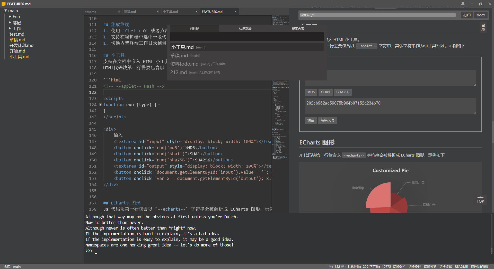

# Yank Note
> 一款面向程序员的 Markdown 笔记应用

[toc]{level: [2]}



## 特色
+ **使用方便**：使用 Monaco 编辑器（vscode 编辑器内核）编辑，针对 Markdown 文件添加了快捷键和补全规则
+ **兼容性强**：资源保存本地，Markdown 文件可简单处理离线工作；拓展功能尽量用 Markdown 原有的语法实现
+ **高拓展性**：可在文档中嵌入小工具、可运行的代码块、ECharts 图形、Plantuml 图形、Drawio 图形等
+ **支持加密**：用来保存账号等隐私文件，文件可单独设置密码

## 注意事项
+ Yank Note 是一款**针对程序员**的 Markdown 编辑器，目标应用场景为在本机写文章，日志，笔记，小工具。
+ 为了更高的拓展性和方便性，Yank Note 牺牲了安全防护（命令执行，任意文件读写）。如果要用它打开外来 Markdown 文件，**请务必仔细甄别文件内容是值得信任的**。
+ 如果要改造为对外的 Web 服务，本工具可能不太适合。或者请运行在可隔离控制的环境下。
+ 加密文件的加密解密操作均在前端完成，请**务必保管好自己的密码**。一旦密码丢失，就只能暴力破解了。

## Yank-Note 2.0 开发计划
[V2 项目看板](https://github.com/purocean/yn/projects/2)

+ [x] 项目更名为 **Yank-Note**
+ [x] 前端界面可以拖动调整尺寸
+ [x] 重构前端项目结构，便于拓展：引入 `vuex`，使用 `async await` 代替可怕的回调，规范文件接口
+ [x] 暴露 Api 接口可以在文档中嵌入轻量应用，以便构建一些小工具
+ [x] 使用 `Electron` 构建为桌面应用。不追求完全做成客户端，还是可以沿用 CS 架构。同样可以在浏览器中使用
+ [x] 支持嵌入 `draw.io` 文档
+ [x] 文件目录增加右键菜单
+ [x] 支持多标签打开多个文件
+ [ ] 拥有更友好的配置界面
+ [ ] 可以自定义快捷键

## 特色功能
+ 同步滚动：编辑区和预览区同步滚动，预览区可独立滚动
+ 目录大纲：预览区目录大纲快速跳转
+ 文件加密：以 `.c.md` 结尾的文件视为加密文件
+ 自动保存：文件编辑后自动保存，未保存文件橙色标题栏提醒（加密文档不自动保存）
+ 编辑优化：列表自动补全
+ 粘贴图片：`Ctrl + V` 粘贴剪切板里面的图片，使用快捷键 `Ctrl + B + V` 作为 Base64 形式粘贴
+ 嵌入附件：可以添加附件到文档，点击在系统中打开
+ 代码运行：支持运行 PHP，nodejs，Python，bash 代码，示例见 FEATURE.md
+ 待办列表：支持显示文档中的待办进度，点击可快速切换待办状态
+ 快速打开：可使用快捷键 `Ctrl + P` 打开文件切换面板，以便快捷打开文件，标记的文件，全文搜索文件内容
+ 内置终端：支持在编辑器打开终端，快速切换当前工作目录
+ 公式解析：支持输入 katex 公式代码
+ 样式风格：Markdown 使用 GitHub 风格样式和特性
+ 数据仓库：可定义多个数据位置以便文档分类
+ 外链转换：将外链或 BASE64 图片转换为本地图片：`Ctrl + Shift + 单击图片` `Ctrl + Alt + L` 转换所有外链图片到本地
+ HTML 解析：可以直接在文档里面使用 HTML 代码，也可以使用快捷键 `Ctrl + M + V` 粘贴复制 HTML 为 Markdown
+ docx 导出：后端使用 pandoc 做转换器
+ TOC 支持：生成 TOC 在需要生成目录的地方写入 `[toc]{type: "ol", level: [1,2,3]}` 即可，，示例见 FEATURE.md
+ 复制标题链接：`Ctrl + 单击标题` 复制标题链接路径到剪切板，便于插入到其他文件
+ 嵌入小工具：文档支持内嵌 HTML 小工具，示例见 FEATURE.md
+ 嵌入 Plantuml 图形：需要安装 Java，graphviz ，示例见 FEATURE.md
+ 嵌入 drawio 图形：文档支持内嵌 drawio 图形，示例见 FEATURE.md
+ 嵌入 ECharts 图形：在文档中嵌入 Echarts 图形，示例见 FEATURE.md
+ 嵌入 Mermaid 图形：在文档中嵌入 Mermaid 图形，示例见 FEATURE.md
+ 元素属性书写：可自定义元素的任意属性，示例见 FEATURE.md
+ 表格解析增强：表格支持表格标题多行文本，列表等特性，示例见 FEATURE.md
+ 文档交叉链接跳转：支持在文档中引入其他文档，互相跳转
+ 脚注功能：支持在文档中书写脚注

## 上手使用
+ 在 [最新版本](https://github.com/purocean/yn/releases) 下载对应平台应用即可
+ 默认快捷键参考 [vscode](https://code.visualstudio.com/)
    + `Ctrl + X` 剪切所选/当前行
    + `Ctrl + C` 复制所选/当前行
    + `Ctrl + Z` 撤消
    + `Ctrl + Shift + Z` 反撤消
    + `Ctrl + /` 注释行
    + `Ctrl + Shift + A` 注释段
    + `Ctrl + K, Ctrl + X` 删除尾部空格
    + `Alt + Click` 插入光标
    + `Shift + Alt + ↑/↓` 在相邻行插入光标
    + `Ctrl + U` 取消最后添加的光标
    + `Shift + Alt + I` 在选中区的所有行的最后添加光标
    + `Ctrl + D` 为下一个匹配项添加光标
    + `Ctrl + F` 查找
    + `Ctrl + H` 替换
+ 自定义编辑器快捷键
    + `Ctrl + P` 打开文件快速跳转面板
    + `Ctrl + S` 保存文档
    + `Ctrl + Enter` 强制插入新行，忽略预置补全规则
    + `Shift + Enter` 强制插入 Tab，忽略预置补全规则
    + `Ctrl + Shift + Up` 当前行上移
    + `Ctrl + Shift + Down` 当前行下移
    + `Ctrl + Shift + D` 重复当前行
    + `Ctrl + Alt + D` 插入当前日期
    + `Ctrl + Alt + T` 插入当前时间
    + `Ctrl + Alt + F` 插入文件附件
    + `Ctrl + Alt + I` 插入文档链接
    + `Ctrl + J` 连接行 join lines
    + `Ctrl + K, Ctrl + U` 转换大写
    + `Ctrl + K, Ctrl + L` 转换小写
    + `Ctrl + Alt + R` 在内置终端里面运行选中内容
    + `Ctrl + M + V` 粘贴 html 富文本
    + `Ctrl + B + V` 粘贴图片为 Base64
    + `Ctrl + Alt + Left/Right` 切换编辑器 Tab

## 开发
依赖安装和编译比较麻烦，请保证自己有足够耐心且有科学上网的手段。

### Windows
Windows 上安装 node-pty 需要费一番功夫，请参考 https://github.com/microsoft/node-pty#windows 配置编译环境。

```bat
REM Node 版本要求 12 v12.7.0
node -v

REM 前端
cd frontend
REM 安装依赖
yarn
REM 打包
yarn run dist
REM 开发
yarn run serve

REM Electron 端
cd ../
REM 安装依赖
win-install.bat
REM 打包 打包前请在前端目录运行打包命令
win-build.bat
REM 开发
yarn run start
```

### Liunx
    TODO 手头没有环境，待完善

### OSX
    TODO 手头没有环境，待完善

## 界面截图


## 更新日志
[最新发布](https://github.com/purocean/yn/releases)

### [v2.3.4](https://github.com/purocean/yn/releases/tag/v2.3.4) 2020-06-28
1. 优化图片相对链接解析
2. 优化转换外链图片为本地图片功能

<details>
<summary>展开查看更多版本记录</summary>

### [v2.3.3](https://github.com/purocean/yn/releases/tag/v2.3.3) 2020-06-11
1. 修正标题过长导致大纲目录样式异常

### [v2.3.2](https://github.com/purocean/yn/releases/tag/v2.3.2) 2020-04-27
1. 调整启动命令行参数

### [v2.3.1](https://github.com/purocean/yn/releases/tag/v2.3.1) 2020-04-27
1. 增加配置监听端口命令行参数 `--port=8080`

### [v2.3.0](https://github.com/purocean/yn/releases/tag/v2.3.0) 2020-04-27
1. 增加启动命令行参数

### [v2.2.11](https://github.com/purocean/yn/releases/tag/v2.2.11) 2020-04-20
1. Drawio 文件渲染增加翻页按钮

### [v2.2.10](https://github.com/purocean/yn/releases/tag/v2.2.10) 2020-04-07
1. 新增粘贴图片为 Base64 形式快捷键 `Ctrl + B + V`
2. 更改粘贴富文本为 Markdown 快捷键为 `Ctrl + M + V`

### [v2.2.9](https://github.com/purocean/yn/releases/tag/v2.2.9) 2020-03-17
1. 修复公式解析问题

### [v2.2.8](https://github.com/purocean/yn/releases/tag/v2.2.8) 2020-03-13
1. 增加切换编辑器标签快捷键 `Ctrl + Alt + Left/Right`

### [v2.2.7](https://github.com/purocean/yn/releases/tag/v2.2.7) 2020-01-19
1. 调整渲染的表格宽度

### [v2.2.6](https://github.com/purocean/yn/releases/tag/v2.2.6) 2020-01-16
1. 修复插入文档名称问题

### [v2.2.5](https://github.com/purocean/yn/releases/tag/v2.2.5) 2020-01-14
1. 修复 frontend yarn.lock 问题

### [v2.2.4](https://github.com/purocean/yn/releases/tag/v2.2.4) 2020-01-14
1. 修复 frontend yarn.lock 问题

### [v2.2.3](https://github.com/purocean/yn/releases/tag/v2.2.3) 2020-01-13
1. 增加复制行内代码功能

### [v2.2.2](https://github.com/purocean/yn/releases/tag/v2.2.2) 2019-12-27
1. 修复快速打开面板小问题

### [v2.2.1](https://github.com/purocean/yn/releases/tag/v2.2.1) 2019-12-26
1. 修复跳转中文路径处理
1. 优化插入文档文件链接

### [v2.2.0](https://github.com/purocean/yn/releases/tag/v2.2.0) 2019-12-25
1. 增加文档之间跳转功能
1. 增加复制文档标题链接功能
1. 调整文档插入选择面板
1. 修复高分辨率下目录树箭头消失问题

### [v2.1.1](https://github.com/purocean/yn/releases/tag/v2.1.1) 2019-12-24
1. 增加在当前目录创建文件菜单
1. 限制快捷跳转列表数量以提高性能
1. 标题栏最大化窗口后移除尺寸调节

### [v2.1.0](https://github.com/purocean/yn/releases/tag/v2.1.0) 2019-11-29
1. 增加多标签同时打开多个文件

### [v2.0.2](https://github.com/purocean/yn/releases/tag/v2.0.2) 2019-11-21
1. 修复相对链接解析
1. 图片增加背景色便于透明图片的阅读

### [v2.0.1](https://github.com/purocean/yn/releases/tag/v2.0.1) 2019-11-20
1. 增加 2.0 计划
1. Electron 打包
1. 增加 HTML 小工具渲染
1. 增加特色功能说明和示例
1. 目录树自动定位文件
1. 目录树增加右键菜单
1. 目录树和集成终端增加拖动调整尺寸功能
1. 使用自定义 UI 控件代替浏览器阻塞性弹出框，优化界面样式，提升交互体验
1. 默认仓库数据和配置改为在 `<home>/yank-note` 下保存
1. 重构前端代码便于拓展
1. 前端重构文件接口

### [v1.23.0](https://github.com/purocean/yn/releases/tag/v1.23.0) 2019-07-09
1. 增加转换所有外链图片到本地功能 `Ctrl + Alt + L`

### [v1.22.0](https://github.com/purocean/yn/releases/tag/v1.22.0) 2019-05-20
1. 增加粘贴 html 富文本功能 `Ctrl + B + V`
1. 增加插入文档快捷键 `Ctrl + Alt + I`
1. 修复 vue cli 3 打包错误
1. 修复图片链接转义
1. 搜索排除 node_modules
1. 上传文件目录优化

### [v1.21.0](https://github.com/purocean/yn/releases/tag/v1.21.0) 2019-05-03
1. 调整抓取图片到本地的逻辑
1. 优化目录树样式
1. 目录树排除 node_modules
1. eslint 规则调整

### [v1.20.0](https://github.com/purocean/yn/releases/tag/v1.20.0) 2019-04-18
1. 无功能变化，前端使用 vue cli 3

### [v1.19.0](https://github.com/purocean/yn/releases/tag/v1.19.0) 2019-04-15
1. 增加终端打开目录功能 `Ctrl + Alt + 单击目录`
1. 增加刷新目录树功能 `Ctrl + Alt + 单击目录`

### [v1.18.2](https://github.com/purocean/yn/releases/tag/v1.18.2) 2019-03-21
1. 保存加密文件密码不一致时增加提示
1. 修复样式问题

### [v1.18.1](https://github.com/purocean/yn/releases/tag/v1.18.1) 2019-03-01
1. 修复目录样式
1. 修复代码块样式

### [v1.18.0](https://github.com/purocean/yn/releases/tag/v1.18.0) 2019-02-28
1. 代码块增加行号显示
1. 支持统一文档锚点跳转
1. 移除 `Mermaid` 支持
1. 优化打印样式
1. 优化行内代码样式

### [v1.17.0](https://github.com/purocean/yn/releases/tag/v1.17.0) 2019-02-20
1. 支持 `ECharts` 图形
1. `Ctrl + Alt + R` 在内置终端中运行选中代码

### [v1.16.2](https://github.com/purocean/yn/releases/tag/v1.16.2) 2019-02-18
1. 文件树增加操作说明
1. 新增/重命名文件后打开新文件

### [v1.16.1](https://github.com/purocean/yn/releases/tag/v1.16.1) 2019-02-17
1. 修复打印样式

### [v1.16.0](https://github.com/purocean/yn/releases/tag/v1.16.0) 2019-02-16
1. 增加 Readme 展示
1. 处理终端退出逻辑

### [v1.15.1](https://github.com/purocean/yn/releases/tag/v1.15.1) 2019-02-14
1. 更新 UI
1. 内置终端增加 windows 适配

### [v1.15.0](https://github.com/purocean/yn/releases/tag/v1.15.0) 2019-02-13
1. 增加内置终端
1. 运行代码支持在内置终端运行

### [v1.14.0](https://github.com/purocean/yn/releases/tag/v1.14.0) 2019-01-16
1. 上传附件增加日期
1. 快速跳转改用模糊搜索并高亮匹配项

### [v1.13.1](https://github.com/purocean/yn/releases/tag/v1.13.1) 2019-01-14
1. 修复 hr 标签样式

### [v1.13.0](https://github.com/purocean/yn/releases/tag/v1.13.0) 2019-01-05
1. 增加 toc
1. 增加返回顶部按钮

### [v1.12.0](https://github.com/purocean/yn/releases/tag/v1.12.0) 2019-01-03
1. 增加连接行快捷键 `Ctrl + J`
1. 增加转换大小写快捷键 `Ctrl + K, Ctrl + U` `Ctrl + K, Ctrl + L`

### [v1.11.0](https://github.com/purocean/yn/releases/tag/v1.11.0) 2019-01-02
1. 切换编辑器自动换行：`Alt + W` 或点击状态栏 `切换换行` 按钮

### [v1.10.0](https://github.com/purocean/yn/releases/tag/v1.10.0) 2018-12-24
1. 文件列表自然排序
1. 文件目录增加子项目数量显示

### [v1.9.0](https://github.com/purocean/yn/releases/tag/v1.9.0) 2018-11-12
1. 增加切换文档预览功能

### [v1.8.0](https://github.com/purocean/yn/releases/tag/v1.8.0) 2018-08-29
1. 增加在系统中打开文件/目录功能 `Ctrl + 双击文件/目录`

### [v1.6](https://github.com/purocean/yn/releases/tag/v1.6) 2018-08-22
1. 修复部分样式不和谐
1. 修复打开新文件编辑器滚动位置不正确
1. 增加将外链或 BASE64 图片转换为本地图片功能
1. 优化代码高亮在暗色主题下的展示
1. 渲染链接默认在新标签打开

### [v1.5.2](https://github.com/purocean/yn/releases/tag/v1.5.2) 2018-08-13
1. 优化输入数字列表体验
1. 增加直接插入回车和Tab的快捷键
1. 确保文件最后有空行
1. 文件跳转按照最近打开文件排序

### [v1.5.1](https://github.com/purocean/yn/releases/tag/v1.5.1) 2018-08-06
1. 修复打开上一次文件bug

### [v1.5](https://github.com/purocean/yn/releases/tag/v1.5) 2018-08-06
1. 增加状态栏
1. 添加多仓库支持

### [v1.4](https://github.com/purocean/yn/releases/tag/v1.4) 2018-08-02
1. 增加全文搜索功能
1. 修复公式定位问题

### [v1.3](https://github.com/purocean/yn/releases/tag/v1.3) 2018-08-02
1. 增加待办记录时间
1. 增加 bat 脚本运行
1. 优化使用体验

### [v1.2](https://github.com/purocean/yn/releases/tag/v1.2) 2018-07-30
1. 增加待办进度条展示

### [v1.1](https://github.com/purocean/yn/releases/tag/v1.1) 2018-07-29
1. 修复若干问题
1. 增加附件插入
1. 调整为暗色主题
1. 图片新标签预览
1. 增加文件筛选面板 Ctrl + p

</details>
