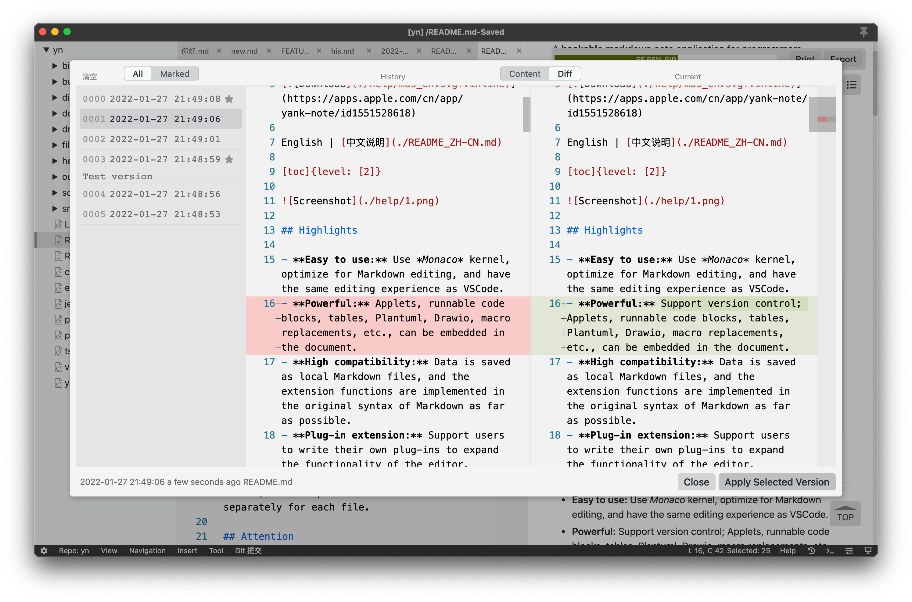
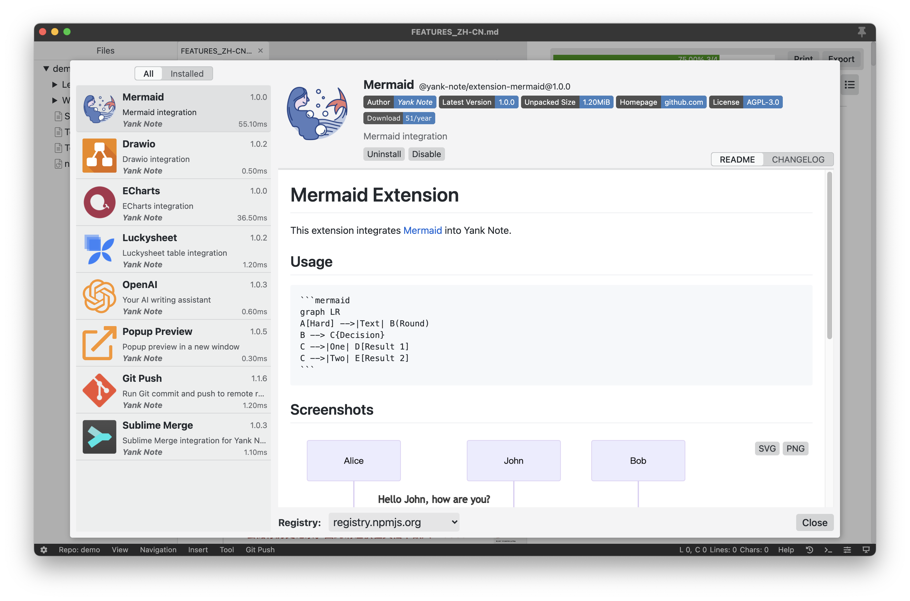

# Yank Note

A **highly extensible** Markdown editor, designed for productivity. **[Download](https://github.com/purocean/yn/releases)** | **[Try it Online >>>](https://demo.yank-note.com/)**

 [Not recommended](https://github.com/purocean/yn/issues/65#issuecomment-1065799677)

English | [中文说明](./README_ZH-CN.md)

[toc]{level: [2]}

## Highlights

- **Easy to use:** Use *Monaco* kernel, optimize for Markdown editing, and have the same editing experience as VSCode.
- **Powerful:** Support version control; Applets, runnable code blocks, tables, PlantUML, Drawio, macro replacements, etc., can be embedded in the document; support for [OpenAI](https://openai.com) auto completion.
- **High compatibility:** Data is saved as local Markdown files, and the extension functions are implemented in the original syntax of Markdown as far as possible.
- **Plug-in extension:** Support users to write their own plug-ins to expand the functionality of the editor.
- **Encryption supported:** Use encryption to save private files such as account number, and the password can be set separately for each file.

## Attention

- For more extendable, Yank Note sacrifices security protection (command execution, arbitrary file reading and writing). If you want to use it to open a foreign Markdown file, ⚠️**be sure to carefully identify whether the content of the file is trustworthy**⚠️.
- The encryption and decryption of encrypted files are both completed at the front end. Please **be sure to remember your password**. Once the password is lost, it can only be cracked violently.

## Characteristic functions

For more information on how to use the following functions, please see [characteristic functions description](./help/FEATURES.md)

- **Sync scrolling:** the editing area and the preview area scroll synchronously, and the preview area can be scrolled independently
- **Outline:** quickly jump to the corresponding location of the document through the directory outline in the preview area
- **Version Control:** Support backtracking document history versions
- **Encryption:** files ending with `.c.md` are treated as encrypted files
- **Auto-save:** automatically save files after editing, with orange title bar reminder for unsaved files (encrypted documents are not automatically saved)
- **Editing:** automatic completion of list
- **Paste images:** you can quickly paste pictures from the clipboard and insert them as files or Base64
- **Embed attachments:** you can add attachments to the document and click to open them in the operating system.
- **Code running:** support to run JavaScript, PHP, nodejs, Python, bash code
- **To-do list:** support to display the to-do progress in the document. Click to quickly switch the to-do status.
- **Quickly Open:** you can use shortcut key to open the file switch panel to quickly open files, tagged files, and full-text search for file contents.
- **Integrated terminal:** support to open the terminal in the editor to quickly switch the current working directory
- **Katex:** support katex expression
- **Style:** Markdown uses GitHub styles and features
- **Repository:** multiple data locations can be defined for document classification
- **External link conversion:** convert external link or Base64 pictures into local pictures
- HTML resolving：you can use HTML code directly in the document, or use shortcut keys to copy and paste HTML to Markdown
- **Multiple formats export:** the backend uses pandoc as converter
- **TOC:** write `[toc]{type:** "ol", level:** [1,2,3]}` to generate TOC where you need to generate a directory
- **Edit table cell:** double-click a table cell to quickly edit
- **Copy title link:** copy title link path to the clipboard for easy insertion into other files
- **Embedded Applets:** document supports embedded HTML Applets
- **Embed PlantUML graphics:** document supports embedded plantUML graphics
- **Embed drawio graphics:** document supports embedded drawio graphics
- **Embed ECharts graphics:** document supports embeded Echarts graphics
- **Embed Mermaid graphics:** document supports embeded Mermaid graphics
- **Embed Luckysheet tables:** document supports embeded Luckysheet tables
- **Mind map:** nested list can be displayed in the form of a mind map
- **Element attribute writing:** any attribute of an element can be customized
- **Table enhancement:** support table title with multiple lines of text, list and other features
- **Document link:** support to link other documents in the document and jump to each other
- **Footnote:** support writing footnotes in the document
- **Custom container:** support custom containers similar to VuePress default themes
- **Macro replacement:** support for embedded JavaScript expressions to dynamically replace document content
- **Image hosting service:** support [PicGo](https://picgo.github.io/PicGo-Doc/) image hosting service
- **OpenAI:** support for [OpenAI](https://openai.com) auto completion
- **Custom plug-ins:** support writing JavaScript plug-ins to expand editor functionality. The plug-in is placed in the `home directory/plugins`. Refer to [plug-in Development Guide](./help/PLUGIN.md)

## Screenshots

## Changelogs

### [v3.53.0](https://github.com/purocean/yn/releases/tag/v3.53.0) 2023-05-11

[Windows](https://github.com/purocean/yn/releases/download/v3.53.0/Yank-Note-win-x64-3.53.0.exe) | [macOS arm64](https://github.com/purocean/yn/releases/download/v3.53.0/Yank-Note-mac-arm64-3.53.0.dmg) | [macOS x64](https://github.com/purocean/yn/releases/download/v3.53.0/Yank-Note-mac-x64-3.53.0.dmg) | [Linux AppImage](https://github.com/purocean/yn/releases/download/v3.53.0/Yank-Note-linux-x86_64-3.53.0.AppImage) | [Linux deb](https://github.com/purocean/yn/releases/download/v3.53.0/Yank-Note-linux-amd64-3.53.0.deb)

1. feat: enable local SVG rendering for PlantUML.
2. feat: support inserting multiple rows/columns at once in table editing.
3. feat: add prompt when the port is already occupied.
4. feat: optimize the automatic update feature.
5. feat: add aliases for nasm code highlighting: asm, s, assembly, masm.
6. feat: include chinese punctuation in the word segmentation and character splitting of the editor.
7. fix: fix the issue that the rename function fails to change only the file name capitalization.
8. fix: fix the issue that the exported HTML TODO list could not correctly display the check status
9. fix: fix the issue that opening the document history panel causes the custom editor theme to be invalidated.
10. feat(plugin): support custom Vue components in the context menu.

[More release notes](https://github.com/purocean/yn/releases)

## Supports

Wechat Group

