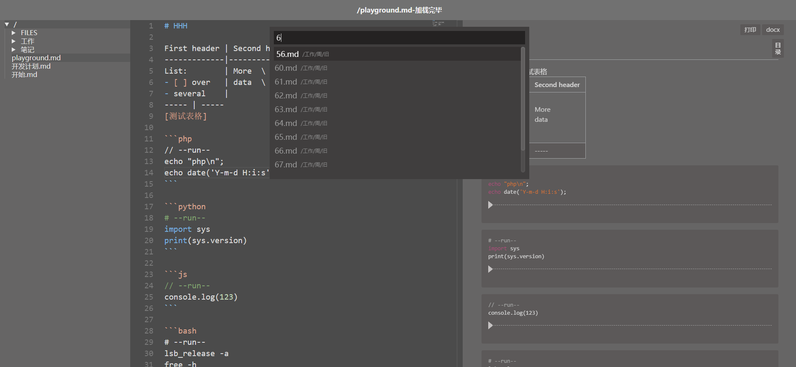
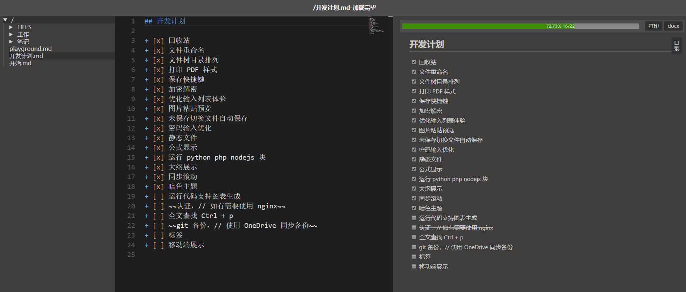
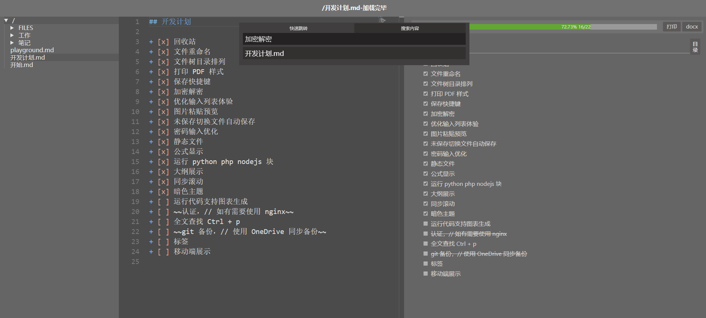

# 自用 markdown 编辑器
>vue + monaco-editor + markdown-it + nodejs + Koa

## 目标
1. 界面字大不费眼 :)
1. markdown 撰写
2. 图片文件保存在本地，导出 markdown 文件可简单处理离线工作
3. 支持一些流程图表绘制 planttuml mermaidt
3. 支持加密解密，用来保存账号等隐私文件，文件可单独设置密码
4. 不需要更多花哨功能，简单够用就行
5. 尽量少依赖三方库，也不花心思维护，杂凑在一起的功能，恰好工作即可 ^_^
6. 在文档中运行 PHP Python Node.js bash 代码块

## 上手使用
+ 安装
    ```bash
    # 安装前端
    cd frontend
    yarn # or npm i
    yarn run dist # or npm run dist
    # yarn run dist-win # or npm run dist-win # Windows 用户

    # 安装后端
    cd ../background
    yarn # or npm i
    node main.js # 运行
    ```
+ 访问 `http://localhost:3000`
+ 新增文件：`双击目录`
+ 在系统中打开文件/目录：`Ctrl ＋ 双击文件/目录`
+ 删除文件/目录：`Shift + 右键文件/目录`
+ 重命名文件/目录：`Ctrl + 右键文件/目录`
+ 切换文档预览显示：`Alt + V` 或点击状态栏 `切换预览` 按钮
+ 切换编辑器自动换行：`Alt + W` 或点击状态栏 `切换换行` 按钮
+ 将外链或 BASE64 图片转换为本地图片：`Ctrl + Shift + 单击图片`
+ 默认文件存储在 `./data` 目录下，添加更多仓库请编辑 `./config.json` 文件
+ 默认快捷键参考 [vscode](https://code.visualstudio.com/)
+ 自定义编辑器快捷键
    + `Ctrl + P` 打开文件快速跳转面板
    + `Ctrl + S` 保存文档
    + `Ctrl + Enter` 强制插入新行，忽略预置补全规则
    + `Shift + Enter` 强制插入 Tab，忽略预置补全规则
    + `Ctrl + Shift + Up` 当前行上移
    + `Ctrl + Shift + Down` 当前行下移
    + `Ctrl + Shift + D` 重复当前行
    + `Ctrl + Alt + D` 插入当前日期
    + `Ctrl + Alt + T` 插入当前时间
    + `Ctrl + Alt + F` 插入文件附件
    + `Ctrl + J` 连接行 join lines
    + `Ctrl + K, Ctrl + U` 转换大写
    + `Ctrl + K, Ctrl + L` 转换小写

## 功能
+ 同步预览滚动，实现得较粗糙
+ 目录大纲展示
+ 文件加密：以 `.c.md` 结尾的文件视为加密文件
+ 自动保存（加密文档不自动保存）
+ 列表自动补全
+ 粘贴剪切板里面的图片
+ 添加附件到文档
+ 运行 PHP，nodejs，Python，bash 代码，代码块第一行需要包含以 `--run--` 字符串，示例见下面截图，当然需要安装相关环境
+ 开启了 HTML 解析，可以直接在文档里面使用 HTML 代码
+ 待办进度条
+ 快速跳转文件，全文搜索文件内容
+ 多仓库切换
+ 生成 TOC 在需要生成目录的地方写入 `[toc]{type: "ol", level: [1,2,3]}` 即可
+ docx 格式导出，需要安装 [pandoc](https://pandoc.org/)
+ markdown 编辑器 [monaco-editor](https://github.com/Microsoft/monaco-editor)
+ markdown 解析 [markdown-it](https://github.com/markdown-it/markdown-it)
+ GitHub 风格样式和特性 [GitHub Flavored Markdown Spec](https://github.github.com/gfm/)
+ 待办列表 [GitHub-style task lists](https://github.com/revin/markdown-it-task-lists)
+ mermaid 图形 [mermaid](https://github.com/knsv/mermaid)
+ Plantuml 图形，需要安装 Java，graphviz [markdown-it-plantuml](https://github.com/gmunguia/markdown-it-plantuml)
+ katex 公式解析 [markdown-it-katex](https://github.com/waylonflinn/markdown-it-katex)
+ 元素属性书写 [markdown-it-attrs](https://github.com/arve0/markdown-it-attrs)
+ 表格解析增强，支持表格标题多行文本，列表等特性 [markdown-it-multimd-table](https://github.com/RedBug312/markdown-it-multimd-table)

## 开发
+ 后端: `cd backend; node main.js`
+ 后端: `cd frontend; yarn run dev`

## 开发计划

+ [x] 回收站
+ [x] 文件重命名
+ [x] 文件树目录排列
+ [x] 打印 PDF 样式
+ [x] 保存快捷键
+ [x] 加密解密
+ [x] 优化输入列表体验
+ [x] 图片粘贴预览
+ [x] 未保存切换文件自动保存
+ [x] 密码输入优化
+ [x] 静态文件
+ [x] 公式显示
+ [x] 运行 python php nodejs 块
+ [x] 大纲展示
+ [x] 同步滚动
+ [x] 暗色主题
+ [x] 全文查找 Ctrl + p
+ [x] 支持多根目录
+ [x] 状态栏
+ [x] toc 生成
+ [ ] 代码块渲染增加行号
+ [ ] 信息流，定时任务
+ [ ] 标签支持
+ [ ] 跨文件跳转
+ [ ] 脚注引用
+ [ ] 表格编辑器
+ [ ] 运行代码支持图表生成
+ [ ] ~~认证，// 如有需要使用 nginx~~
+ [ ] ~~git 备份，// 使用 OneDrive 同步备份~~
+ [ ] 移动端展示





