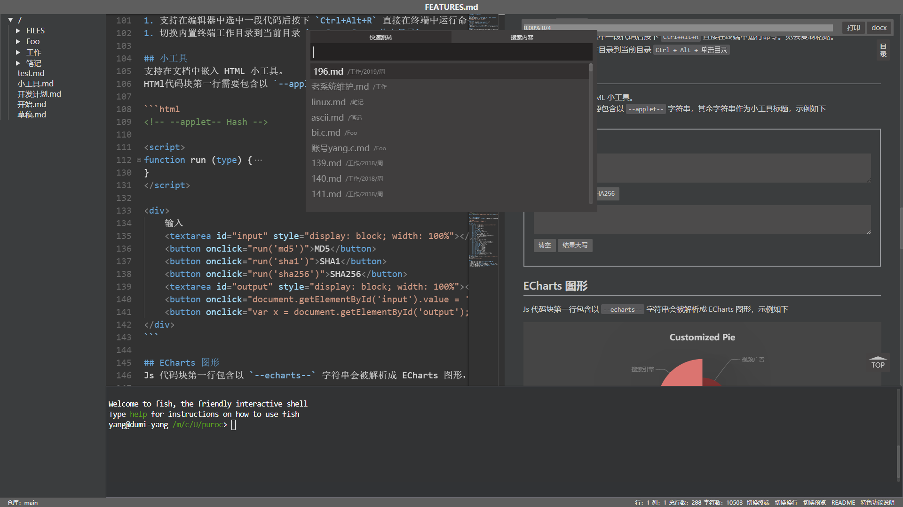
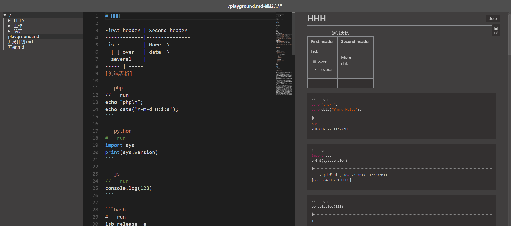
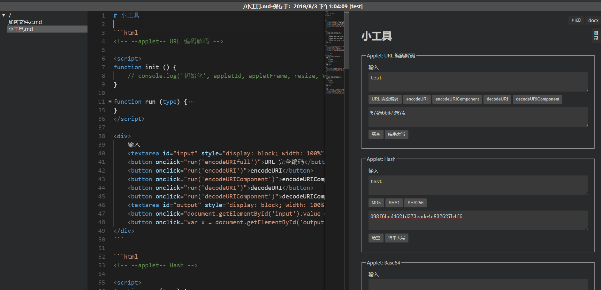

# 自用 markdown 编辑器
>vue + monaco-editor + markdown-it + nodejs + Koa

[toc]{level: [2]}



## 目标
1. 界面字大不费眼 :)
1. markdown 撰写
2. 图片文件保存在本地，导出 markdown 文件可简单处理离线工作
3. 支持一些流程图表绘制 planttuml
3. 支持加密解密，用来保存账号等隐私文件，文件可单独设置密码
4. 不需要更多花哨功能，简单够用就行
5. 尽量少依赖三方库，也不花心思维护，杂凑在一起的功能，恰好工作即可 ^_^
6. 在文档中运行 PHP Python Node.js bash 代码块

## 上手使用
+ 安装
    ```bash
    # 安装前端
    cd frontend
    yarn # or npm i
    yarn run dist # or npm run dist
    # yarn run dist-win # or npm run dist-win # Windows 用户

    # 安装后端
    cd ../background
    yarn # or npm i
    node main.js # 运行
    ```
+ 访问 `http://localhost:3000`
+ 新增文件：`双击目录`
+ 在系统中打开文件/目录：`Ctrl ＋ 双击文件/目录`
+ 删除文件/目录：`Shift + 右键文件/目录`
+ 重命名文件/目录：`Ctrl + 右键文件/目录`
+ 切换文档预览显示：`Alt + V` 或点击状态栏 `切换预览` 按钮
+ 切换编辑器自动换行：`Alt + W` 或点击状态栏 `切换换行` 按钮
+ 切换内置终端展示：`Alt + O` 或点击状态栏 `切换终端` 按钮
+ 切换内置终端工作目录到当前目录 `Ctrl + Alt + 单击目录`
+ 刷新目录树 `双击目录空白区域`
+ 将外链或 BASE64 图片转换为本地图片：`Ctrl + Shift + 单击图片`
+ 默认文件存储在 `./data` 目录下，添加更多仓库请编辑 `./config.json` 文件
+ 默认快捷键参考 [vscode](https://code.visualstudio.com/)
    + `Ctrl + X` 剪切所选/当前行
    + `Ctrl + C` 复制所选/当前行
    + `Ctrl + Z` 撤消
    + `Ctrl + Shift + Z` 反撤消
    + `Ctrl + /` 注释行
    + `Ctrl + Shift + A` 注释段
    + `Ctrl + K, Ctrl + X` 删除尾部空格
    + `Alt + Click` 插入光标
    + `Shift + Alt + ↑/↓` 在相邻行插入光标
    + `Ctrl + U` 取消最后添加的光标
    + `Shift + Alt + I` 在选中区的所有行的最后添加光标
    + `Ctrl + D` 为下一个匹配项添加光标
    + `Ctrl + F` 查找
    + `Ctrl + H` 替换
+ 自定义编辑器快捷键
    + `Ctrl + P` 打开文件快速跳转面板
    + `Ctrl + S` 保存文档
    + `Ctrl + Enter` 强制插入新行，忽略预置补全规则
    + `Shift + Enter` 强制插入 Tab，忽略预置补全规则
    + `Ctrl + Shift + Up` 当前行上移
    + `Ctrl + Shift + Down` 当前行下移
    + `Ctrl + Shift + D` 重复当前行
    + `Ctrl + Alt + D` 插入当前日期
    + `Ctrl + Alt + T` 插入当前时间
    + `Ctrl + Alt + F` 插入文件附件
    + `Ctrl + J` 连接行 join lines
    + `Ctrl + K, Ctrl + U` 转换大写
    + `Ctrl + K, Ctrl + L` 转换小写
    + `Ctrl + Alt + R` 在内置终端里面运行选中内容

## 特色功能
+ 同步预览滚动，实现得较粗糙
+ 目录大纲展示
+ 文件加密：以 `.c.md` 结尾的文件视为加密文件
+ 自动保存（加密文档不自动保存）
+ 列表自动补全
+ 粘贴剪切板里面的图片
+ 添加附件到文档
+ 运行 PHP，nodejs，Python，bash 代码，**代码块第一行需要包含以 `--run--` 字符串，示例见下面截图，当然需要安装相关环境**
+ 开启了 HTML 解析，可以直接在文档里面使用 HTML 代码
+ 待办进度条
+ 快速跳转文件，全文搜索文件内容
+ 多仓库切换
+ 生成 TOC 在需要生成目录的地方写入 `[toc]{type: "ol", level: [1,2,3]}` 即可
+ docx 格式导出，**需要安装 [pandoc](https://pandoc.org/)**
+ ECharts 图形支持 [ECharts](https://echarts.baidu.com/) **Js 代码块第一行需要包含以 `--echarts--` 字符串，示例见下面截图**
+ markdown 编辑器 [monaco-editor](https://github.com/Microsoft/monaco-editor)
+ markdown 解析 [markdown-it](https://github.com/markdown-it/markdown-it)
+ GitHub 风格样式和特性 [GitHub Flavored Markdown Spec](https://github.github.com/gfm/)
+ 待办列表 [GitHub-style task lists](https://github.com/revin/markdown-it-task-lists)
+ Plantuml 图形，**需要安装 Java，graphviz [markdown-it-plantuml](https://github.com/gmunguia/markdown-it-plantuml)**
+ katex 公式解析 [markdown-it-katex](https://github.com/waylonflinn/markdown-it-katex)
+ 元素属性书写 [markdown-it-attrs](https://github.com/arve0/markdown-it-attrs)
+ 表格解析增强，支持表格标题多行文本，列表等特性 [markdown-it-multimd-table](https://github.com/RedBug312/markdown-it-multimd-table)
+ 内置终端 [XTERM.JS](https://xtermjs.org/) [node-pty](https://github.com/Microsoft/node-pty)

## 开发贡献
+ 前端: `cd backend; node main.js`
+ 后端: `cd frontend; yarn run dev`

## 捐赠
如果我的工作对您有帮助，请我喝杯咖啡吧 ^_^。**附言可以留下您的 github 用户名或网站连接**。

　　

1. [wangyedong66](https://github.com/wangyedong66) 2元
1. [yubingcen](https://github.com/yubingcen) 0.1元

## 界面截图





## 更新日志
[最新发布](https://github.com/purocean/yn/releases)

### [v1.18.2](https://github.com/purocean/yn/releases/tag/v1.18.2) 2019-03-21
1. 保存加密文件密码不一致时增加提示
1. 修复样式问题

### [v1.18.1](https://github.com/purocean/yn/releases/tag/v1.18.1) 2019-03-01
1. 修复目录样式
1. 修复代码块样式

### [v1.18.0](https://github.com/purocean/yn/releases/tag/v1.18.0) 2019-02-28
1. 代码块增加行号显示
1. 支持统一文档锚点跳转
1. 移除 `Mermaid` 支持
1. 优化打印样式
1. 优化行内代码样式

### [v1.17.0](https://github.com/purocean/yn/releases/tag/v1.17.0) 2019-02-20
1. 支持 `ECharts` 图形
1. `Ctrl + Alt + R` 在内置终端中运行选中代码

### [v1.16.2](https://github.com/purocean/yn/releases/tag/v1.16.2) 2019-02-18
1. 文件树增加操作说明
1. 新增/重命名文件后打开新文件

### [v1.16.1](https://github.com/purocean/yn/releases/tag/v1.16.1) 2019-02-17
1. 修复打印样式

### [v1.16.0](https://github.com/purocean/yn/releases/tag/v1.16.0) 2019-02-16
1. 增加 Readme 展示
1. 处理终端退出逻辑

### [v1.15.1](https://github.com/purocean/yn/releases/tag/v1.15.1) 2019-02-14
1. 更新 UI
1. 内置终端增加 windows 适配

### [v1.15.0](https://github.com/purocean/yn/releases/tag/v1.15.0) 2019-02-13
1. 增加内置终端
1. 运行代码支持在内置终端运行

### [v1.14.0](https://github.com/purocean/yn/releases/tag/v1.14.0) 2019-01-16
1. 上传附件增加日期
1. 快速跳转改用模糊搜索并高亮匹配项

### [v1.13.1](https://github.com/purocean/yn/releases/tag/v1.13.1) 2019-01-14
1. 修复 hr 标签样式

### [v1.13.0](https://github.com/purocean/yn/releases/tag/v1.13.0) 2019-01-05
1. 增加 toc
1. 增加返回顶部按钮

### [v1.12.0](https://github.com/purocean/yn/releases/tag/v1.12.0) 2019-01-03
1. 增加连接行快捷键 `Ctrl + J`
1. 增加转换大小写快捷键 `Ctrl + K, Ctrl + U` `Ctrl + K, Ctrl + L`

### [v1.11.0](https://github.com/purocean/yn/releases/tag/v1.11.0) 2019-01-02
1. 切换编辑器自动换行：`Alt + W` 或点击状态栏 `切换换行` 按钮

### [v1.10.0](https://github.com/purocean/yn/releases/tag/v1.10.0) 2018-12-24
1. 文件列表自然排序
1. 文件目录增加子项目数量显示

### [v1.9.0](https://github.com/purocean/yn/releases/tag/v1.9.0) 2018-11-12
1. 增加切换文档预览功能

### [v1.8.0](https://github.com/purocean/yn/releases/tag/v1.8.0) 2018-08-29
1. 增加在系统中打开文件/目录功能 `Ctrl + 双击文件/目录`

### [v1.6](https://github.com/purocean/yn/releases/tag/v1.6) 2018-08-22
1. 修复部分样式不和谐
1. 修复打开新文件编辑器滚动位置不正确
1. 增加将外链或 BASE64 图片转换为本地图片功能
1. 优化代码高亮在暗色主题下的展示
1. 渲染链接默认在新标签打开

### [v1.5.2](https://github.com/purocean/yn/releases/tag/v1.5.2) 2018-08-13
1. 优化输入数字列表体验
1. 增加直接插入回车和Tab的快捷键
1. 确保文件最后有空行
1. 文件跳转按照最近打开文件排序

### [v1.5.1](https://github.com/purocean/yn/releases/tag/v1.5.1) 2018-08-06
1. 修复打开上一次文件bug

### [v1.5](https://github.com/purocean/yn/releases/tag/v1.5) 2018-08-06
1. 增加状态栏
1. 添加多仓库支持

### [v1.4](https://github.com/purocean/yn/releases/tag/v1.4) 2018-08-02
1. 增加全文搜索功能
1. 修复公式定位问题

### [v1.3](https://github.com/purocean/yn/releases/tag/v1.3) 2018-08-02
1. 增加待办记录时间
1. 增加 bat 脚本运行
1. 优化使用体验

### [v1.2](https://github.com/purocean/yn/releases/tag/v1.2) 2018-07-30
1. 增加待办进度条展示

### [v1.1](https://github.com/purocean/yn/releases/tag/v1.1) 2018-07-29
1. 修复若干问题
1. 增加附件插入
1. 调整为暗色主题
1. 图片新标签预览
1. 增加文件筛选面板 Ctrl + p

## 开发计划
+ [x] 回收站
+ [x] 文件重命名
+ [x] 文件树目录排列
+ [x] 打印 PDF 样式
+ [x] 保存快捷键
+ [x] 加密解密
+ [x] 优化输入列表体验
+ [x] 图片粘贴预览
+ [x] 未保存切换文件自动保存
+ [x] 密码输入优化
+ [x] 静态文件
+ [x] 公式显示
+ [x] 运行 python php nodejs 块
+ [x] 大纲展示
+ [x] 同步滚动
+ [x] 暗色主题
+ [x] 全文查找 Ctrl + p
+ [x] 支持多根目录
+ [x] 状态栏
+ [x] toc 生成
+ [x] 内置终端
+ [x] ECharts 图表
+ [x] 代码块渲染增加行号
+ [x] 脚注引用
+ [ ] 信息流，定时任务
+ [ ] 标签支持
+ [ ] 跨文件跳转
+ [ ] 表格编辑器
+ [ ] 运行代码支持图表生成
+ [ ] ~~认证，// 如有需要使用 nginx~~
+ [ ] ~~git 备份，// 使用 OneDrive 同步备份~~
+ [ ] 移动端展示
