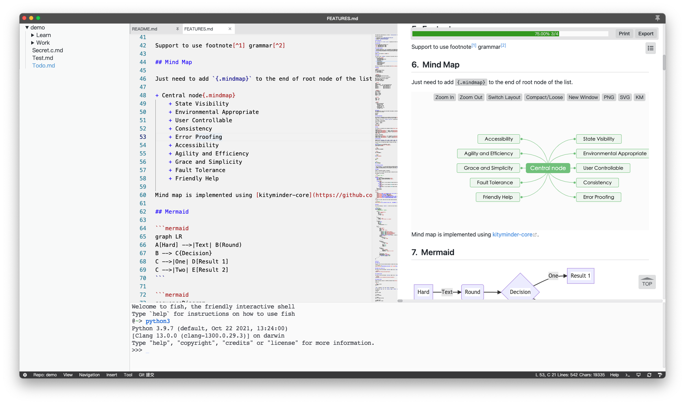
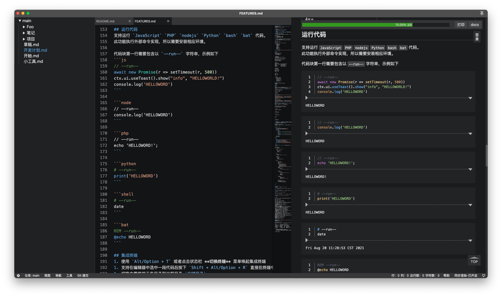

# Yank Note

一款面向程序员的 Markdown 笔记应用 **[在线体验>>>](https://yank-note.vercel.app/)**

[English](./README.md) | 中文说明

[toc]{level: [2]}

## 特色

- **使用方便**：使用 Monaco 内核，专为 Markdown 优化，拥有和 VSCode 一样的编辑体验。
- **功能强大**：可在文档中嵌入小工具、可运行的代码块、表格、Plantuml 图形、Drawio 图形、宏替换等。
- **兼容性强**：数据保存为本地 Markdown 文件；拓展功能尽量用 Markdown 原有的语法实现。
- **插件拓展**：支持用户编写自己的插件来拓展编辑器的功能。
- **支持加密**：用来保存账号等隐私文件，文件可单独设置密码。

## 注意事项

- 为了更高的拓展性和方便性，Yank Note 牺牲了安全防护（命令执行，任意文件读写）。如果要用它打开外来 Markdown 文件，**请务必仔细甄别文件内容是值得信任的**。
- 加密文件的加密解密操作均在前端完成，请**务必牢记自己的密码**。一旦密码丢失，就只能暴力破解了。

## Yank-Note V3 开发计划

V3 核心目标是重构代码，提升应用健壮性、可拓展性、Markdown 渲染性能

[V3 项目看板](https://github.com/purocean/yn/projects/5)

- [x] 使用 Vite 构建
- [x] 优化 Markdown 渲染性能，支持 Vue 组件方式拓展功能
- [x] 重构 Electron 代码
- [x] 重构业务逻辑，和组件解耦
- [x] 完善自定义插件文档
- [ ] 增强文档检索，引用体验
- [ ] 重构快捷键处理层，支持自定义快捷键
- [ ] 其他 V2 未完成的功能
- [ ] 增加移动端

## 特色功能

以下功能具体使用可参考[特色功能说明](./help/FEATURES.md)

- **同步滚动:** 编辑区和预览区同步滚动，预览区可独立滚动
- **目录大纲:** 预览区目录大纲快速跳转
- **文件加密:** 以 `.c.md` 结尾的文件视为加密文件
- **自动保存:** 文件编辑后自动保存，未保存文件橙色标题栏提醒（加密文档不自动保存）
- **编辑优化:** 列表自动补全
- **粘贴图片:** 可快速粘贴剪切板里面的图片，可作为文件或 Base64 形式插入
- **嵌入附件:** 可以添加附件到文档，点击在系统中打开
- **代码运行:** 支持运行 JavaScript、PHP、nodejs、Python、bash 代码
- **待办列表:** 支持显示文档中的待办进度，点击可快速切换待办状态
- **快速打开:** 可使用快捷键打开文件切换面板，以便快捷打开文件，标记的文件，全文搜索文件内容
- **内置终端:** 支持在编辑器打开终端，快速切换当前工作目录
- **公式解析:** 支持输入 katex 公式代码
- **样式风格:** Markdown 使用 GitHub 风格样式和特性
- **数据仓库:** 可定义多个数据位置以便文档分类
- **外链转换:** 将外链或 BASE64 图片转换为本地图片
- **HTML 解析:** 可以直接在文档里面使用 HTML 代码，也可以使用快捷键粘贴复制 HTML 为 Markdown
- **docx 导出:** 后端使用 pandoc 做转换器
- **TOC 支持:** 生成 TOC 在需要生成目录的地方写入 `[toc]{type: "ol", level: [1,2,3]}` 即可
- **编辑表格单元格:** 双击表格单元格即可快速编辑
- **复制标题链接:** 复制标题链接路径到剪切板，便于插入到其他文件
- **嵌入小工具:** 文档支持内嵌 HTML 小工具
- **嵌入 Plantuml 图形:** 需要安装 Java，graphviz
- **嵌入 drawio 图形:** 文档支持内嵌 drawio 图形
- **嵌入 ECharts 图形:** 在文档中嵌入 Echarts 图形
- **嵌入 Mermaid 图形:** 在文档中嵌入 Mermaid 图形
- **嵌入 Luckysheet 表格:** 在文档中嵌入 Luckysheet 表格
- **嵌套列表转脑图展示:** 可将嵌套列表用脑图的方式展示
- **元素属性书写:** 可自定义元素的任意属性
- **表格解析增强:** 表格支持表格标题多行文本，列表等特性
- **文档交叉链接跳转:** 支持在文档中链接其他文档，互相跳转
- **脚注功能:** 支持在文档中书写脚注
- **容器块:** 支持类似 VuePress 默认主题的自定义容器
- **宏替换:** 支持内嵌 JavaScript 表达式动态替换文档内容
- **图床:** 支持 [PicGo](https://picgo.github.io/PicGo-Doc/) 图床
- **自定义插件:** 支持编写 JavaScript 插件拓展编辑器功能。插件放置在 `主目录/plugins` 中。参考[插件开发指南](./help/PLUGIN.md)

## 截图

## 更新日志

### [v3.12.1](https://github.com/purocean/yn/releases/tag/v3.12.1) 2021-11-21
1. 文档: 快捷键增加英文文档
2. 宏: 更换限定符，尽量少减少冲突
3. 插件: 增加 `ctx.version`

[更多发布说明](https://github.com/purocean/yn/releases)
