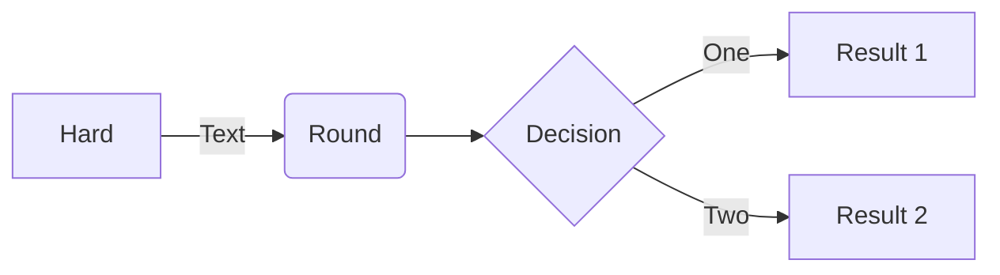
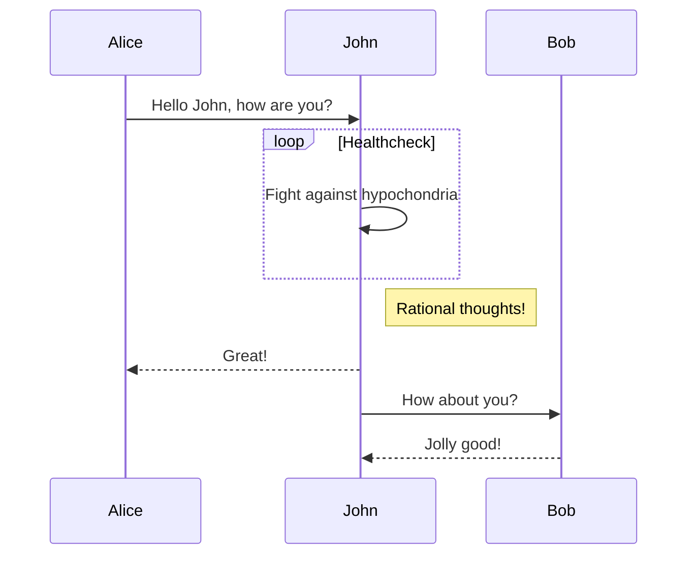
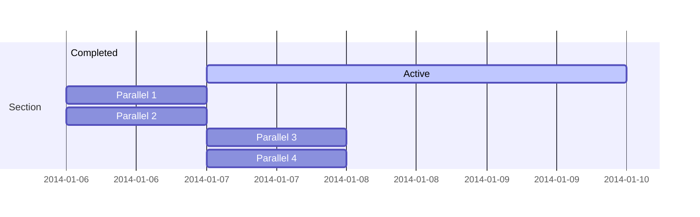
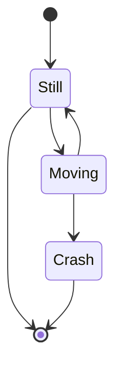
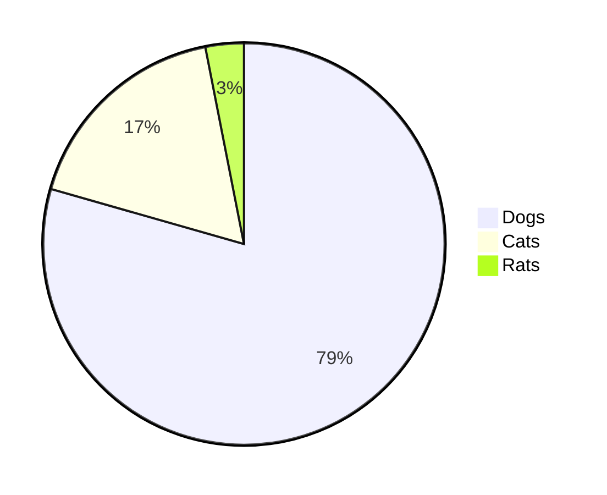
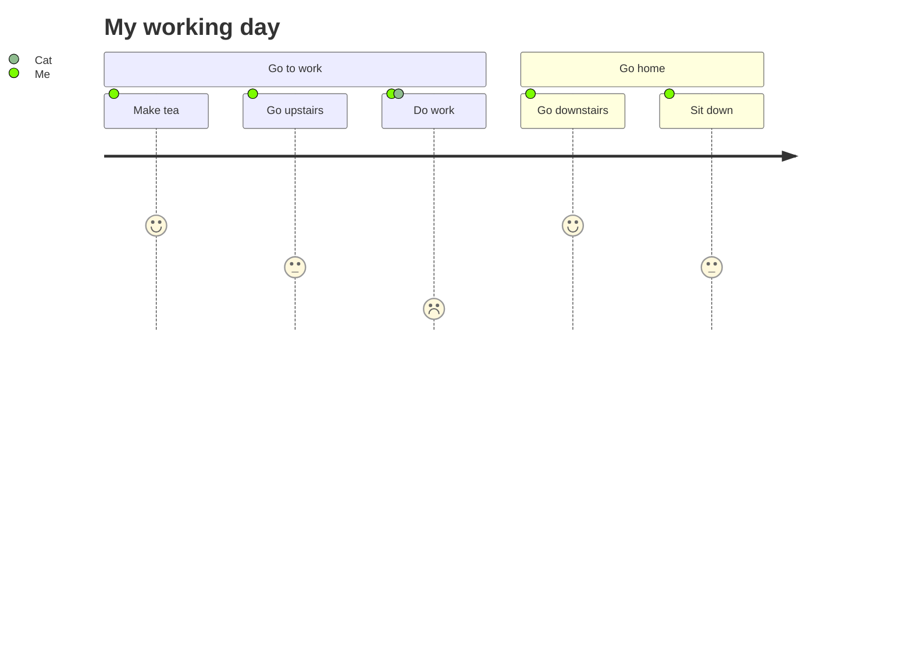

# Yank-Note Features Instructions

English | [中文](./FEATURES_ZH-CN.md)

[toc]{type: "ol", level: [2]}

## Data Storage

The application generated data is stored in `<home>/yank-note` dir, click the "Open Main Dir" menu in the tray to view them.

Directory description

1. configuration file `<home>/yank-note/config.json`
1. export docx reference doc `<home>/yank-note/pandoc-reference.docx`
1. document versions `<home>/yank-note/histories`
    ::: tip
    If you accidentally lost your document content, you can check this folder and try to recovery it.
    :::
1. plug-ins `<home>/yank-note/plugins`
1. themes `<home>/yank-note/themes`

## TOC Generation

Use `[toc]{type: "ul", level: [1,2,3]}` to generate the TOC of document.

## TODO Switch

Click the TODO item in preview to try
+ [x] ~~2021-06-06 10:27~~ TEST1
+ [x] ~~2021-06-06 10:27~~ TEST2
+ [x] ~~2021-06-06 10:27~~ TEST3

## Encrypted Document

1. Documents ending with `.c.md` are regarded as encrypted documents and can be used to store confidential information.
2. The encryption and decryption processes are both completed at the frontend.
3. Be sure to keep the password of the encrypted document properly. Once the password is lost, it can only be cracked violently.

## Markdown Enhance

Type '/' in the editor to get prompts

+ Mark: ==marked==
+ Sup: 29^th^
+ Sub: H~2~0
+ Footnote: footnote[^1] syntax[^2]
+ Abbr：
    *[HTML]: Hyper Text Markup Language
    *[W3C]:  World Wide Web Consortium
    The HTML specification is maintained by the W3C.

### Element Attribute

This feature is implemented using [markdown-it-attrs](https://github.com/arve0/markdown-it-attrs).

- Red Text, White background {.bgw style="color:red"}
- Display As **Block Element**{.block}

**Some built-in style classes:**

| Class Name | Description |
| -- | -- |
| `new-page` | Page break before this element when printing/exporting PDF |
| `skip-print` | Skip this element when printing/exporting PDF |
| `skip-export` | Skip this element when exporting/copying HTML |
| `inline` | The current element is displayed as an inline element |
| `block` | The current element is displayed as a block element |
| `reduce-brightness` | Reduce the brightness of this element when using dark theme |
| `bgw` | Set current element background to white |

### Image Enhancement

1. The picture will be rendered as a block element and centered by default, with a transparent background color.
    + If you want to display the image as an inline element, you can add `.inline` after the image link parameter, such as: 
    + If you want to add a white background to the image to optimize the display effect (for some transparent images), you can add `.bgw` after the image link parameter, such as: 

1. You can use [markdown-it-imsize](https://github.com/tatsy/markdown-it-imsize) to set the image size. For example, this is an image with a width of 16px: 

## Mind Map

Just need to add `{.mindmap}` to the end of root node of the list.

+ Central node{.mindmap}
    + [1] State Visibility
    + [2] Environmental Appropriate
    + [3] User Controllable
    + [4] Consistency
    + [5] Error Proofing
    + [6] Accessibility
    + [7] Agility and Efficiency
    + [8] Grace and Simplicity
    + [9] Fault Tolerance
    + [10] Friendly Help

Mind map is implemented using [kityminder-core](https://github.com/fex-team/kityminder-core).

## Mermaid













## Plantuml


If you are configured to use local endpoint in the Setting, the system needs to have a Java environment with Graphviz installed.

::: warning
if it prompts an error `Cannot find Graphviz`,
Please refer to [Test your GraphViz installation](https://plantuml.com/graphviz-dot)
:::

The example is as follows

@startuml
a -> b
@enduml

## Table Enhancement

This feature is implemented using [markdown-it-multimd-table](https://github.com/RedBug312/markdown-it-multimd-table).
Support the use of multiple lines of text and lists in tables. Support table description rendering.

You can double click / right click table cell to quickly edit table cell content.

First header | Second header
-------------|---------------
List:        | More  \
- [ ] over   | data  \
- several    |
Test | Test
[Test Table]

First header | Second header
:-----------:|:--------------:
AAAAAAAAAAAA | BBBBBBBBBBBBBB
AAAAAAAAAAAA | BBBBBBBBBBBBBB
AAAAAAAAAAAA | BBBBBBBBBBBBBB
AAAAAAAAAAAA | BBBBBBBBBBBBBB
AAAAAAAAAAAA | BBBBBBBBBBBBBB
Test | Test
[Small Table]
{.small}

## Katex

This feature is provided by the [markdown-it-katex](https://github.com/waylonflinn/markdown-it-katex) plugin.

$$\begin{array}{c}
\nabla \times \vec{\mathbf{B}} -\, \frac1c\, \frac{\partial\vec{\mathbf{E}}}{\partial t} &
= \frac{4\pi}{c}\vec{\mathbf{j}}    \nabla \cdot \vec{\mathbf{E}} & = 4 \pi \rho \\
\nabla \times \vec{\mathbf{E}}\, +\, \frac1c\, \frac{\partial\vec{\mathbf{B}}}{\partial t} & = \vec{\mathbf{0}} \\
\nabla \cdot \vec{\mathbf{B}} & = 0
\end{array}$$

equation | description
----------|------------
$\nabla \cdot \vec{\mathbf{B}}  = 0$ | divergence of $\vec{\mathbf{B}}$ is zero
$\nabla \times \vec{\mathbf{E}}\, +\, \frac1c\, \frac{\partial\vec{\mathbf{B}}}{\partial t}  = \vec{\mathbf{0}}$ |  curl of $\vec{\mathbf{E}}$ is proportional to the rate of change of $\vec{\mathbf{B}}$
$\nabla \times \vec{\mathbf{B}} -\, \frac1c\, \frac{\partial\vec{\mathbf{E}}}{\partial t} = \frac{4\pi}{c}\vec{\mathbf{j}}    \nabla \cdot \vec{\mathbf{E}} = 4 \pi \rho$ | _what?_

## Code Running

Support to run `JavaScript` `PHP` `nodejs` `Python` `bash` `bat` code.
This function is implemented by executing external commands, so the corresponding environment needs to be installed.

The first line of the code block needs to contain the string `--run--`, an example is as follows
```js
// --run--
await new Promise(r => setTimeout(r, 500))
ctx.ui.useToast().show("info", "HELLOWORLD!")
console.log('HELLOWORD')
```

```node
// --run--
console.log('HELLOWORD')
```

```php
// --run--
echo 'HELLOWORD!';
```

```python
# --run--
print('HELLOWORD')
```

```shell
# --run--
date
```

```bat
REM --run--
@echo HELLOWORD
```

## Integrated Terminal

1. Use `Alt/Option + T` or click the status bar **Switch terminal** menu to call up the integrated terminal
1. Support to select a piece of code in the editor and press `Shift + Alt/Option + R` to run the command directly in the terminal. No need to copy and paste.
1. Switch the working directory of the terminal to the current directory: `right-click directory`

## Applets

Support to embed HTML applets in documents.

The first line of the HTML code block needs to contain the string `--applet--`, and the remaining strings are used as the title of the applet.

The example is as follows:

```html
<!-- --applet-- Hash -->

<script>
function run (type) {
    const input = document.getElementById('input')
    const output = document.getElementById('output')
    output.value = ''

    switch (type) {
        case 'md5':
            output.value = ctx.lib.cryptojs.MD5(input.value).toString().toLowerCase()
            break
        case 'sha1':
            output.value = ctx.lib.cryptojs.SHA1(input.value).toString().toLowerCase()
            break
        case 'sha256':
            output.value = ctx.lib.cryptojs.SHA256(input.value).toString().toLowerCase()
            break
    }
    output.focus()
    output.select()
}
</script>

<div>
    Input
    <textarea id="input" style="display: block; width: 100%"></textarea>
    <button onclick="run('md5')">MD5</button>
    <button onclick="run('sha1')">SHA1</button>
    <button onclick="run('sha256')">SHA256</button>
    <textarea id="output" style="display: block; width: 100%"></textarea>
    <button onclick="document.getElementById('input').value = ''; document.getElementById('output').value = ''">Clear</button>
    <button onclick="var x = document.getElementById('output'); x.value = x.value.toUpperCase()">Uppercase</button>
</div>
```
If there is no title, there will be no outer border decoration

```html
<!-- --applet--  -->
<button onclick="ctx.ui.useToast().show(`info`, `HELLOWORLD!`)">HELLO</button>
```

## ECharts

The string containing `--echarts--` in the first line of the Js code block will be resolved into ECharts graphics, the example is as follows

```js
// --echarts--
function (chart) {
chart.setOption({
    // backgroundColor: '#2c343c',

    title: {
        text: 'Customized Pie',
        left: 'center',
        top: 20,
        textStyle: {
            color: '#888'
        }
    },

    tooltip : {
        trigger: 'item',
        formatter: "{a} <br/>{b} : {c} ({d}%)"
    },

    visualMap: {
        show: false,
        min: 80,
        max: 600,
        inRange: {
            colorLightness: [0, 1]
        }
    },
    series : [
        {
            name:'referer',
            type:'pie',
            radius : '55%',
            center: ['50%', '50%'],
            data:[
                {value:335, name:'Direct visit'},
                {value:310, name:'Email marketing'},
                {value:274, name:'Affiliate advertising'},
                {value:235, name:'Video advertisement'},
                {value:400, name:'Search engine'}
            ].sort(function (a, b) { return a.value - b.value; }),
            roseType: 'radius',
            label: {
                normal: {
                    textStyle: {
                        color: '#888'
                    }
                }
            },
            labelLine: {
                normal: {
                    lineStyle: {
                        color: '#888'
                    },
                    smooth: 0.2,
                    length: 10,
                    length2: 20
                }
            },
            itemStyle: {
                normal: {
                    color: '#c23531',
                    shadowBlur: 200,
                    shadowColor: 'rgba(0, 0, 0, 0.5)'
                }
            },

            animationType: 'scale',
            animationEasing: 'elasticOut',
            animationDelay: function (idx) {
                return Math.random() * 200;
            }
        }
    ]
}, true)
}
```

## Draw.io

The value of the link attribute `link-type` needs to be a `drawio` string. The use of the link format will not affect other Markdown resolver resolving.

```markdown
[drawio](./test.drawio){link-type="drawio"}
```

## Luckysheet Table

The value of the link attribute `link-type` needs to be a `luckysheet` string. The use of the link format will not affect other Markdown resolver resolving.

```markdown
[luckysheet](./test.luckysheet){link-type="luckysheet"}
```

## Container Block

Support functions similiar to [VuePress Container Block](https://v2.vuepress.vuejs.org/zh/reference/default-theme/markdown.html#%E8%87%AA%E5%AE%9A%E4%B9%89%E5%AE%B9%E5%99%A8),using [markdown-it-container](https://github.com/markdown-it/markdown-it-container) to achieve.

**Use It**

```md
::: <type> [title]
[content]
:::
```

`type` is required, `title` and `content` are optional.

The supported `types` are: `tip` `warning` `danger` `details` `group` `group-item`

**Example**

::: tip
This is a prompt
:::

::: warning
This is a warning
:::

::: danger
This is a danger warning
:::

::: danger STOP
Dangerous area, no pass
:::

::: details
This is a details label
:::

::: details click to expand more
This is a details label
:::

:::: group This is label group

::: group-item Tab 1
test 1
:::

::: group-item *Tab 2
test 2
Title starts with `*` mean that this tab is activated by default
:::

::: group-item Tab 3
test 3
:::

::::

## Front Matter

The page supports configuration information similar to [Jekyll Front Matter](https://jekyllrb.com/docs/front-matter/)

Built-in variables

variable name | type | description
---- | ----- | ---
`headingNumber` | `boolean` | whether to enable the page title serial number
`enableMacro` | `boolean` | whether to enable macro replacement
`define` | `Record<string, string>` | Macro definition, string replacing
`mdOptions` | `Record<string, boolean>` | Markdown-it parse options
`mdOptions.html` | `boolean` | Enable HTML tags in source
`mdOptions.breaks` | `boolean` | Convert `\n` in paragraphs into `<br>`
`mdOptions.linkify` | `boolean` | Autoconvert URL-like text to links
`mdOptions.typographer` | `boolean` | Enable some language-neutral replacement + quotes beautification

## Macro Replacement

> <a href="javascript: ctx.showPremium()">available in premium version</a>

Yank Note allows you to embed macros in the page to dynamically replace the document.

Before using, you need to enable macro replacement in Front Matter and define `enableMacro: true`

### Definition

The `define` field can define some text replacement mappings. Supports definition in another file, supports macro expressions. For details, please refer to the Front Matter at the top of this document.

- App Name: --APP_NAME--
- App Version: --APP_VERSION--
- From Another File: --TEST_DEFINE--

### Macro Expression

Syntax:

```md
[= <expression> =]
```

 `expression` is the js expression that needs to be executed, and supports await/Promise asynchronous expressions.

If the expression needs to contain [\= or =\], please enter `[\=` or `=\]` to escape and replace.

### Examples

- whether to enable the page title serial number:  [= headingNumber =]
- use variable:  [= customVar =]
- custom variable:  [= $export('testVar', 'Test') =][= testVar =]
- custom function:  [= $export('format', (a, b) => `${a}, ${b}!`) =][= format('HELLO', 'WORLD') =]
- application version: [= $ctx.version =]
- current document name: [= $doc.basename =]
- current time:  [= $ctx.lib.dayjs().format('YYYY-MM-DD HH:mm') =]
- qualifier escape:  [= '[\= =\]' =]
- Arithmetic:  [= (1 + 2) / 2 =]
- reference file (support 3 levels of nesting, you can use Front Matter variable defined in the target document):
    > [= $include('./_FRAGMENT.md', true) =]
- variable defined in the referenced document: [= customVarFromOtherDoc =]
- your IP address: [= fetch('https://ifconfig.me/ip').then(r => r.text()) =]
- weather forecast:
    ```
    [= await ctx.utils.sleep(1000), fetch('https://wttr.in?0AT').then(r => r.text()) =]
    ```
- Nine-Nine Multiplication Table:
  [=
  (function nine (num) {
      let res = ''
      for (let i = 1; i <= num; i++) {
          let str = '';
          for (let k = 1; k <= num; k++) {
              if (i >= k) {
                  str += k + 'x' + i + '=' + i*k + ' ';
              }
          }
          res = res + str + '\n'
      }
      return res
  })(9)
  =]

### Available Variables

Macro expression can use variables defined in Front Matter, or use the following built-in variables

variable name | type | description
---- | ----- | ---
`$ctx` | `object` | Editor `ctx`，refer to [Plug-In Development GUide](PLUGIN.md) and [Api Document](https://yn-api-doc.vercel.app/modules/renderer_context.html)
`$include` | `(path: string, trim = false) => Result` | Introduce other document fragment methods
`$export` | `(key: string, val: any) => Result` | Define a variable that can be used in this document
`$noop` | `() => Result` | no operation, Used for holding text space
`$doc` | `object` | Current document information
`$doc.basename` | `string` | File name of current document (no suffix)
`$doc.name` | `string` | File name of current document
`$doc.path` | `string` | Current document path
`$doc.repo` | `string` | Current document repository
`$doc.content` | `string` | Current document content
`$doc.status` | `'loaded', 'save-failed', 'saved'` | Current document status

## Command Line Parameters

When handing over documents to others, you can use scripts or custom command line parameters to start the application to facilitate the other party to view the documents.

name               | use         | default value |  description                    | example
----------------- | ------------ | ----- | ----------------------- | ----
--port            | Server listening port | 3044 | port                      | --port=8080
--disable-tray    | Disable the resident tray   | false | true/false              | --disable-tray
--readonly        | Editor readonly    | false | true/false               | --readonly
--show-status-bar | Show status bar    | true  | true/false               | --show-status-bar=false
--data-dir        | Data directory      | none     |      directory path string       | --data-dir='./.data'
--init-repo       | Initial repository name    | none   | string                    | --init-repo='test'
--init-file       | Load file path  | none   | file path, relative to repository path     | --init-file='/1.md'

## Custom Styles

1. Right click the tray icon and click "Open Main Dir", go to the `themes` folder.
2. Copy `github.css` to a new CSS file ans modify it.
3. Open Setting => Appearance => Custom CSS switch CSS file.

## Plug-In Development

Please refer to [Plug-In Development Guide](PLUGIN.md)

[^1]: This is a footnote
[^2]: This is a footnote too
