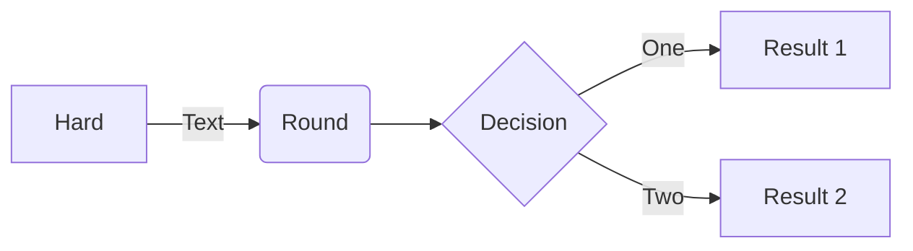
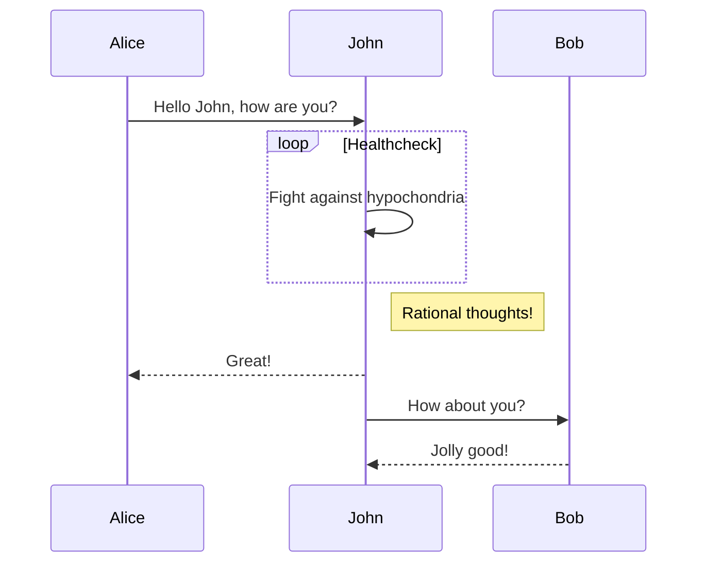
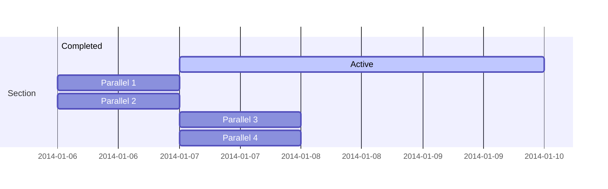
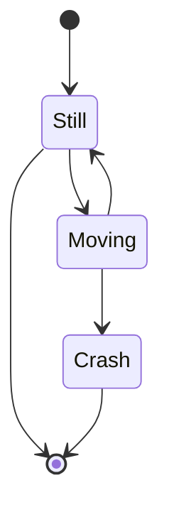
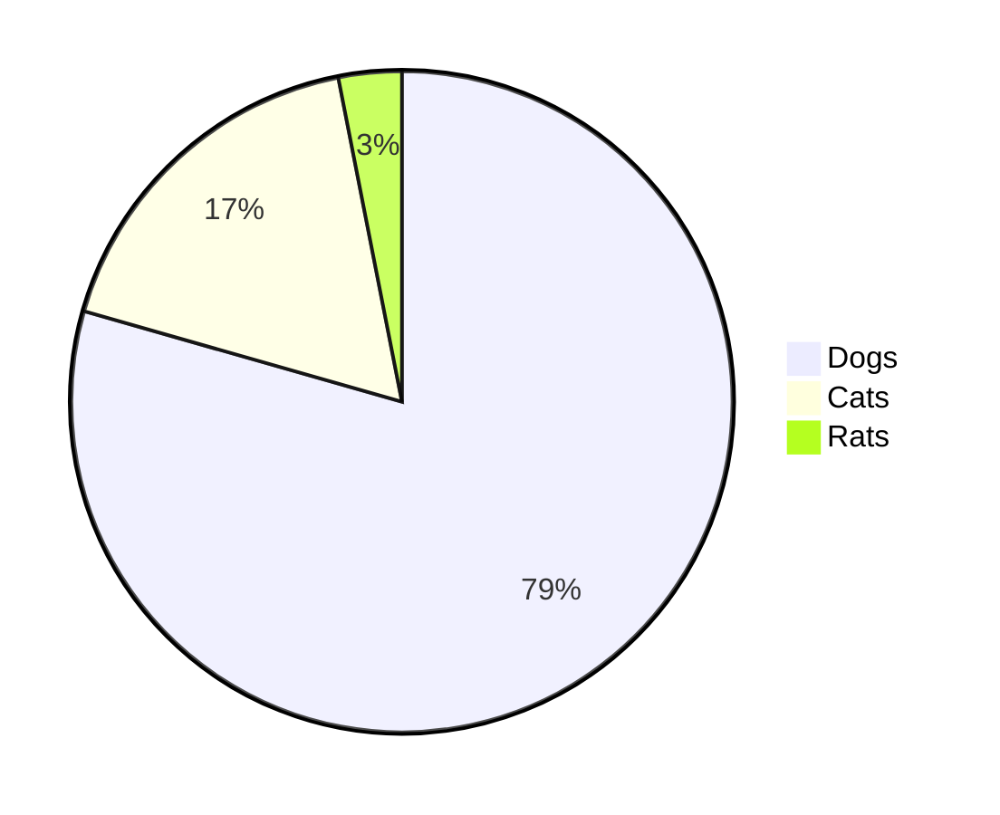
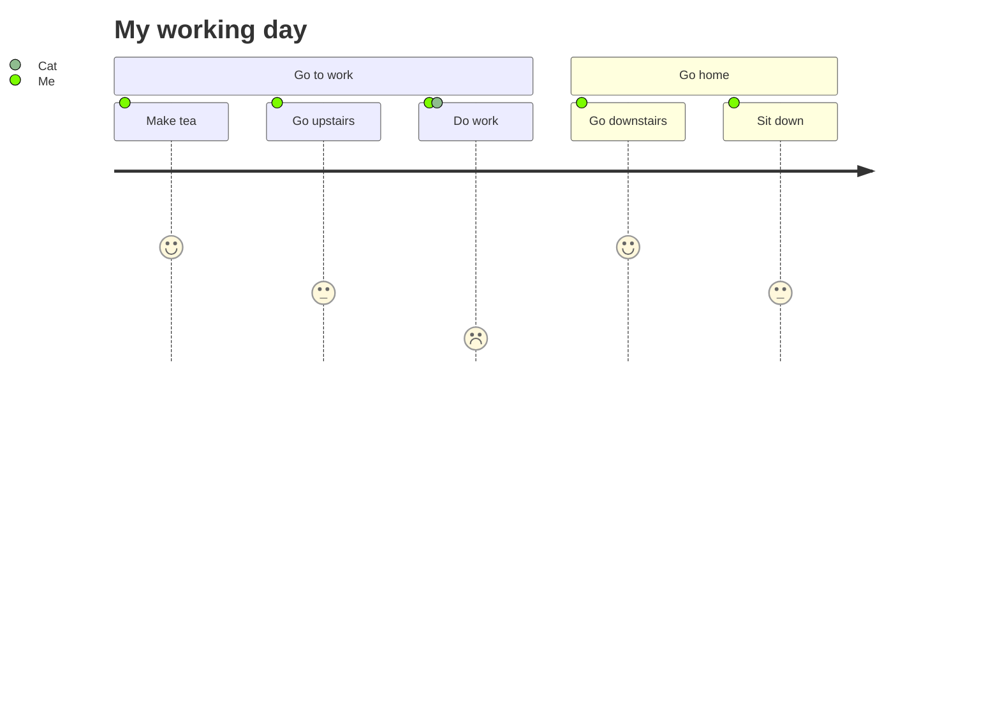

# Yank-Note 特色功能使用说明

## TOC 生成
需要生成目录的地方写入 `[toc]{type: "ul", level: [1,2,3]}`
可以控制目录样式 `ul` 或 `ol` 和级别

[toc]{type: "ol", level: [2,3]}

## 系统配置
1. 用户数据目录存放在 `<home>/yank-note` 下面
1. 配置文件 `<home/yank-note/config.json>`

## 多仓库
1. 系统默认有一个 `main` 仓库，默认位于 `<home>/yank-note/main`
1. 在配置文件 `<home/yank-note/config.json>` 中可以配置多个仓库，或者自定义 `main` 仓库路径

## 文件管理
右键目录树可看到文件相关操作选项。
进行删除文件/目录操作后，文件并没有真正删除，还可以从 `<home>/yank-note/trash` 目录下面恢复

## 待办切换
在预览界面打勾试试
+ [x] ~~2021-06-06 10:27~~ TEST1
+ [x] ~~2021-06-06 10:27~~ TEST2
+ [x] ~~2021-06-06 10:27~~ TEST3

## 加密文档
1. 以 `.c.md` 结尾的文档视为加密文档，可以用来保存机密的信息。
2. 加密和解密过程均在前端完成。
3. 请务必保管好文档密码，密码一旦丢失就只能自己暴力破解了。

## 脚注功能
支持使用脚注[^1]语法[^2]

## 思维导图
只需要在列表根节点加上 `{.mindmap}` 即可。

+ 中心节点{.mindmap}
    + 状态可见原则
    + 环境贴切原则
    + 用户可控原则
    + 一致性原则
    + 防错原则
    + 易取原则
    + 灵活高效原则
    + 优美且简约原则
    + 容错原则
    + 人性化帮助原则

脑图使用 [kityminder-core](https://github.com/fex-team/kityminder-core) 实现。

## Mermaid 图形解析













## Plantuml 图形解析
系统需要有 Java 环境，并安装有 graphviz
示例如下

@startuml
a -> b
@enduml

## 表格增强
此功能使用 [markdown-it-multimd-table](https://github.com/RedBug312/markdown-it-multimd-table) 实现
支持在表格中使用多行文本和列表。支持表格说明渲染

另外您可以使用：`Ctrl/Cmd + 单击单元格` 快捷编辑表格单元格内容

First header | Second header
-------------|---------------
List:        | More  \
- [ ] over   | data  \
- several    |
----- | -----
Test | Test
[测试表格]

## Katex 公式解析
此功能由 [markdown-it-katex](https://github.com/waylonflinn/markdown-it-katex) 插件提供

$$\begin{array}{c}
\nabla \times \vec{\mathbf{B}} -\, \frac1c\, \frac{\partial\vec{\mathbf{E}}}{\partial t} &
= \frac{4\pi}{c}\vec{\mathbf{j}}    \nabla \cdot \vec{\mathbf{E}} & = 4 \pi \rho \\
\nabla \times \vec{\mathbf{E}}\, +\, \frac1c\, \frac{\partial\vec{\mathbf{B}}}{\partial t} & = \vec{\mathbf{0}} \\
\nabla \cdot \vec{\mathbf{B}} & = 0
\end{array}$$

equation | description
----------|------------
$\nabla \cdot \vec{\mathbf{B}}  = 0$ | divergence of $\vec{\mathbf{B}}$ is zero
$\nabla \times \vec{\mathbf{E}}\, +\, \frac1c\, \frac{\partial\vec{\mathbf{B}}}{\partial t}  = \vec{\mathbf{0}}$ |  curl of $\vec{\mathbf{E}}$ is proportional to the rate of change of $\vec{\mathbf{B}}$
$\nabla \times \vec{\mathbf{B}} -\, \frac1c\, \frac{\partial\vec{\mathbf{E}}}{\partial t} = \frac{4\pi}{c}\vec{\mathbf{j}}    \nabla \cdot \vec{\mathbf{E}} = 4 \pi \rho$ | _wha?_

## 运行代码
支持运行 `JavaScript` `PHP` `nodejs` `Python` `bash` `bat` 代码。
此功能执行外部命令实现，所以需要安装相应环境。

代码块第一行需要包含以 `--run--` 字符串，示例如下
```js
// --run--
await new Promise(r => setTimeout(r, 500))
ctx.ui.useToast().show("info", "HELLOWORLD!")
console.log('HELLOWORD')
```

```node
// --run--
console.log('HELLOWORD')
```

```php
// --run--
echo 'HELLOWORD!';
```

```python
# --run--
print('HELLOWORD')
```

```shell
# --run--
date
```

```bat
REM --run--
@echo HELLOWORD
```

## 集成终端
1. 使用 `Alt/Option + T` 或者点击状态栏 **切换终端** 菜单唤起集成终端
1. 支持在编辑器中选中一段代码后按下 `Shift + Alt/Option + R` 直接在终端中运行命令。免去复制粘贴。
1. 切换内置终端工作目录到当前目录 `右键目录`

## 小工具
支持在文档中嵌入 HTML 小工具。
HTMl代码块第一行需要包含以 `--applet--` 字符串，其余字符串作为小工具标题，示例如下

```html
<!-- --applet-- Hash -->

<script>
function run (type) {
    const input = document.getElementById('input')
    const output = document.getElementById('output')
    output.value = ''

    switch (type) {
        case 'md5':
            output.value = CryptoJS.MD5(input.value).toString().toLowerCase()
            break
        case 'sha1':
            output.value = CryptoJS.SHA1(input.value).toString().toLowerCase()
            break
        case 'sha256':
            output.value = CryptoJS.SHA256(input.value).toString().toLowerCase()
            break
    }
    output.focus()
    output.select()
}
</script>

<div>
    输入
    <textarea id="input" style="display: block; width: 100%"></textarea>
    <button onclick="run('md5')">MD5</button>
    <button onclick="run('sha1')">SHA1</button>
    <button onclick="run('sha256')">SHA256</button>
    <textarea id="output" style="display: block; width: 100%"></textarea>
    <button onclick="document.getElementById('input').value = ''; document.getElementById('output').value = ''">清空</button>
    <button onclick="var x = document.getElementById('output'); x.value = x.value.toUpperCase()">结果大写</button>
</div>
```

## ECharts 图形
Js 代码块第一行包含以 `--echarts--` 字符串会被解析成 ECharts 图形，示例如下

```js
// --echarts--
function (chart) {
chart.setOption({
    // backgroundColor: '#2c343c',

    title: {
        text: 'Customized Pie',
        left: 'center',
        top: 20,
        textStyle: {
            color: '#ccc'
        }
    },

    tooltip : {
        trigger: 'item',
        formatter: "{a} <br/>{b} : {c} ({d}%)"
    },

    visualMap: {
        show: false,
        min: 80,
        max: 600,
        inRange: {
            colorLightness: [0, 1]
        }
    },
    series : [
        {
            name:'访问来源',
            type:'pie',
            radius : '55%',
            center: ['50%', '50%'],
            data:[
                {value:335, name:'直接访问'},
                {value:310, name:'邮件营销'},
                {value:274, name:'联盟广告'},
                {value:235, name:'视频广告'},
                {value:400, name:'搜索引擎'}
            ].sort(function (a, b) { return a.value - b.value; }),
            roseType: 'radius',
            label: {
                normal: {
                    textStyle: {
                        color: 'rgba(255, 255, 255, 0.3)'
                    }
                }
            },
            labelLine: {
                normal: {
                    lineStyle: {
                        color: 'rgba(255, 255, 255, 0.3)'
                    },
                    smooth: 0.2,
                    length: 10,
                    length2: 20
                }
            },
            itemStyle: {
                normal: {
                    color: '#c23531',
                    shadowBlur: 200,
                    shadowColor: 'rgba(0, 0, 0, 0.5)'
                }
            },

            animationType: 'scale',
            animationEasing: 'elasticOut',
            animationDelay: function (idx) {
                return Math.random() * 200;
            }
        }
    ]
})
}
```

## 嵌入 Draw.io 图形
### 嵌入 xml
xml 代码块 第一行注释需要有 `--drawio--` 文字
```xml
<!-- --drawio-- -->
<mxfile modified="2019-08-08T10:12:50.344Z" host="" agent="Mozilla/5.0 (Windows NT 10.0; Win64; x64) AppleWebKit/537.36 (KHTML, like Gecko) draw.master/1.1.2 Chrome/76.0.3809.88 Electron/6.0.0 Safari/537.36" etag="Sj0MCp6T4t3TRFXfBnGH" version="11.1.1" type="device"><diagram name="Page-1" id="c7558073-3199-34d8-9f00-42111426c3f3">7V3bd6M2E/9r/Lg5gEDgx8R2uj1nk+Y0e9qvj8SWbb5i5ALOpX99JW5GI9mxveKWTV5iSzDAzPzmphEeocnm9ZfY367v6IKEI8tYvI7QdGRZpuFh9o+PvOUjHvLygVUcLIqD9gOPwb+kPLMY3QULkggHppSGabAVB+c0isg8Fcb8OKYv4mFLGopX3forIg08zv1QHv0zWKTr4iksvB//SoLVuryyicf5zJM//3sV011UXG9koWX2l09v/JJW8aDJ2l/Ql9oQmo3QJKY0zT9tXick5Lwt2Zafd3tgtrrvmETpKSdY+QnPfrgj5R3jkJ16s+V3l74VHMH/7Pgt3Wz8eBVEI3TNZo0tk/dN9lR88EtKt/mEXU6k5DX94ofBqjhjzu6KxLW5BZnT2E8DWhzA+EbiMIhIdkx5UfZpVfzPbi1JYxqtytGHmM5JkrCzzfKAp3jEn/sWnsiGxHNrE1s4tj5A5HzGhGSZ5jNeMQOf7PEtScmGHfCY7hhmjtxVE1d/iAnTmFwMyktbwkWtZxKnAQPLdS7Z6SZYLPjcTSHqaSVnyg5dhpmCLwOmeOhmSaO0wLtpFd9v/U0QckvxlYTPhJPm7E83IT+IfczwRBbFt4xCcTNmoQ1/VzBF/Ah2qQkNaZzdLprh29vJREZGARb+NOS1NlQg5RdCNySNmTSMYtZCBf7fwPeXvY0wSxO2rtmHcTHmF2ZpVZHeQ5N9KNCpRiqSkDqLmHgJiQOuz0BEL+sgJY9bf86/vzAjrZLOQTmezeLbW10stkUWm5bM4rGCw1gDh22Jw79GzyRJaZx8GP7ahqjBjtkaex2Jvb/df5nO7q7vp9zw/fX4fXbHPkxnf8y+/fZwN7v/LnGdecst/7gtTD66+TE5JLkhMq4M23Uuk8tkokfvDeNqXP8zBTmhsSwn21AIytEgKPyRYgJr+DHBdeSHb0mQfPrmIwBCY9GymXaLvtkdPmLewdFBrBhosAD7FiQpm36gSRI8McotR937mJ+GOy68T4AfAzj2gEt0ZZfYGMC9nxjg9mABPiWpH3AxTtY0IQdy2wYBXuD6E9ZHYO1gkJHYLcJ6/BPD2hksrO/JC/eahftsF9NTknB5fiL6CKJBjcEp0dsGoku6PyWk8bAh3U343e5VJyzMT+Pd/DMueMeKmJ53ZR8uiLVrVORVsjs/8ldkw5/vo5SGMWAxNq6M+p8lMbypSrEpr3V8QH4jB105dQaLKx/YkTW8MYbLSx8fcXEJ2WKN3RVNigWm22O/vDTyB4kWH2ndybHHKuZ2oOtItbwBuEwWK1LyKaJZ8BbRWW1wz7was8ZjjmKJrdZB9iV0F8+LSxYmL2WBBCmOKk7kN3OUxXUXqFoTqgZjErLQ9JkIN6HiZXGNBxpwe7tfoxKEJq015Y9TnLQXiETHBIRMSChngkQok2z13KcJW1WZ717Y9gCE7QEhwUDqVGkjQAjS0Sdss7RKP2Pu5w479+uonPPItC/dccp+tGj74t9Jkmbh1WcaeCRkQ2IaaIsxW5tpoKOyL9CZRItr3n/ani8Zy76kNITvOpMfDggcliJ65hi7LGczTeQIwrE9QPFUl2EbxhWyXA97HgvKHW8s0sXNxQuOnOnzim/MkMDtIQsdkckFtdxFWQmHoS99k5SAewMuTRamM3x/555k+sWRwaqhSoJF1qj6uZACDpYOOMhZeq95Va0sVRGN3CHSGK/kBHtK5ztezyjbbit2xZQ3BSQBM9A+d8PbmP6fzFM5F2xRzTyxNoEUi3SNsU5OjmWrW7OwJHyiLzWTe5MNsIk1jYN/mSPzQ+022JFtcN/ieUeMwh10YThvAkI2JHTAGDOv6L/VDtvyA5IjvgWsCyNX2MjAPuQUL7b0Z5YBulArS1Yrp+dqZehSK0hIl1qBbBRhzWolFxxmof/E80JSM/JzylvPbp9IRJZBWpvI8scOLT0yOrT0qi6rnkFSYelxzyAJCy6l5Tw/DAeELEhIEyZt0DCATM2YVLX59EyvcP9NPXJ06ZXTkl7BEMLSq1cl+bqtfw3Kmk5p0RdinN+dZffE9VwxGWJ+UVif8VBrZh/LZZV7wsudPqez94wk168u8yDbMwUeWiIPHXHWaC+/xJbEw4eYruK8aLxn4ZbGnSaSju0cUUJmqUQGtqiEcjGjlwzEwFeaNlYxtA2OySWNXnLMBagEdg8rZ9vg3wDqGoqopOyF6k1YAgsFptrPnb1sCchCqoCstlBYrOeatuaQRVfVo1yP4kMRu/z/RnwbreWU3/8aNbHW4Q1AH6vK2o+2SWBAqME2CXxmm0QXtsgdgOwx6JkU40ME25dO1QT3KFmpK0qjXgygIqOwCX3LnB0XJKLehYpQLXcfsi2a3JB0w5qrpPjMikxCVjyFrmtW42U9r2dKhGCV7FJrAsttp9qPs5UI9gsWi4i6lKjU0ePll+zdZJ2mvOioT7CNd5qOm8o/XLnsMvtnF2zzHvuKf8mWzIMlC/U6Ll9h0wGMay9Vcy1NbrAWNTduv9ye2a9qafBHlwoxINTUUiGGS5KalyVcueTUM61ShNx9C61gjf9irYL70FvTKqRZq+Sy3O89qJzj8pTqhVbA79ntWXO58Fa9iqXm+K4Xzz5LWFacbfXxrFHY+BZsgnxJp1OuIqhMXVUz3QG00yg6ZXtnzkDM7FycKQJCNiTUUKZoa27TcgdQmVIEX+O+6RUMvi7dzQOjOPvE7Txn6xV0x55mvRpAZcscgmIBD+ReHH8BQvjE+OsS2cvVp69+vHhh0hiVG4FKb/9Il2kxwTPhbkMosA1CsfelKffuycUCDXAhr0GaLRwVn/mikXGVvYm1+T0yqG9IAh7bvbRDG7p+3FCHtu2qr6PLRHuWpHOKBoPfO28wgE1B4g41htKOQnJPV32hSRdnDgCZFoh5DqzynYtTCx1ryGtwk5t3UudOD4AFoSO+rwMiy2oPWQNo3SmDg14jyzwKAde+0AO+gyxIVtfWEhtYft3+UC6x9BK2luMoS3t7w9aVQ9RVS2is4K4Erd0z0IKw72KUmjB+PBGXl0BnANm+Itk/eR//524/9XXgjwLork56A9hZpAqx+1b2dsSXg3lgu3nV9nS+nh1765gNyepKjM1mta5UauF1cXEivkag62pVta2nZAJuz9GXL7KsMWjCXXbWxsLX8yZ1RpUvHioHwuAp9uOg0+VSE2y9tLFy41EbvLT6b+JUrtPomYmDKYkpRsWXu9KjuU5j2+ihA9dt4oZQu1IE631zrIdexX62lgFCTblOCzY06NYrufT1CO1/157TRONj+bODlVso23AFctmr+jmEvjDPto6+L65DPypXbyTNey6juM7YhxywDRxyryl+sa/7Hz3Ogb3/ZWk0+w8=</diagram></mxfile>
```

### 嵌入本地 drawio 文件
链接属性 `link-type` 值需要是 `drawio` 字符串。使用链接的形式也不会影响其他 Markdown 解析器解析。

```markdown
[drawio](./test.drawio){link-type="drawio"}
```

## 嵌入 Luckysheet 表格文件
链接属性 `link-type` 值需要是 `luckysheet` 字符串。使用链接的形式也不会影响其他 Markdown 解析器解析。

```markdown
[luckysheet](./test.luckysheet){link-type="luckysheet"}
```

## 快捷键

这里仅列出部分常用快捷键和自定义快捷键，默认编辑器快捷键参考 [vscode](https://code.visualstudio.com/)。

功能 | Windows | macOS
---- | ------ | -----
剪切所选/当前行 | Ctrl + X | Cmd + X
复制所选/当前行 | Ctrl + C | Cmd + X
撤销 | Ctrl + Z | Cmd + Z
重做 | Ctrl + Shift + Z | Cmd + Shift + Z
在选中区的所有行的最后添加光标 | Shift + Alt + I | Shift + Option + I
在相邻行插入光标 | Ctrl + Alt + ↑/↓ | Cmd + Option + ↑/↓
为下一个匹配项添加光标 | Ctrl + D | Cmd + D
查找 | Ctrl + F | Cmd + F
打开文件快速跳转面板 | Ctrl + P | Cmd + P
插入文档链接 | Ctrl + Alt + I | Cmd + Option + I
保存文档 | Ctrl + S | Cmd + S
连接行 | Ctrl + J | Cmd + J
强制插入新行，忽略预置补全规则 | Ctrl + Enter | Cmd + Enter
强制插入 Tab，忽略预置补全规则 | Shift + Enter | Shift + Enter
当前行上移 | Ctrl + Shift + Up | Cmd + Shift + Up
当前行下移 | Ctrl + Shift + Down | Cmd + Shift + Down
重复当前行 | Ctrl + Shift + D | Cmd + Shift + D
插入当前日期 | Shift + Alt + D | Shift + Option + D
插入当前时间 | Shift + Alt + T | Shift + Option + T
插入文件附件 | Shift + Alt + F | Shift + Option + F
在内置终端里面运行选中内容 | Shift + Alt + R | Shift + Option + R
转换大写 | Ctrl + K, Ctrl + U | Cmd + K, Cmd + U
转换小写 | Ctrl + K, Ctrl + L | Cmd + K, Cmd + K
粘贴 HTML 富文本 | Ctrl + D + V | Cmd + D + V
粘贴图片为 base64 链接 | Ctrl + B + V | Cmd + B + V
转换单个外链图片到本地 | Ctrl + Shift + 单击图片 | Cmd + Shift + 单击图片
转换所有外链图片到本地 | Ctrl + Shift + L | Cmd + Shift + L
编辑表格单元格 | 双击单元格 | 双击单元格
编辑表格单元格(弹出框) | Ctrl + 单击单元格 | Cmd + 单击单元格 或
复制文档标题链接 | Ctrl + 单击标题 | Cmd + 单击标题
切换编辑器 Tab | Ctrl + Alt + Left/Right | Ctrl + Option + Left/Rig
切换侧栏 | Alt + E | Option + E
切换编辑器自动换行 | Alt + W | Option + W
切换文档预览显示 | Alt + V | Option + V
切换终端 | Alt + T | Option + T
演示模式 | F5 | F5
查看 Readme | Alt + H | Option + H

## 元素属性书写
此功能使用 [markdown-it-attrs](https://github.com/arve0/markdown-it-attrs) 实现
示例红色文字：
**test**{style="color:red"}

## 命令行参数
在向别人交接文档的时候，可以使用脚本，自定义命令行参数启动程序，方便对方查看文档。

名称               | 作用         | 默认值 | 说明                    | 示例
----------------- | ------------ | ----- | ----------------------- | ----
--port            | 服务器监听端口 | 3044 | 端口                      | --port=8080
--disable-tray    | 禁用常驻托盘   | false | true/false              | --disable-tray
--readonly        | 编辑器只读    | false | true/false               | --readonly
--show-status-bar | 显示状态栏    | true  | true/false               | --show-status-bar=false
--data-dir        | 数据目录      | 无     | 目录路径字符串            | --data-dir='./.data'
--init-repo       | 初始仓库名    | 无    | 字符串                    | --init-repo='test'
--init-file       | 加载文件路径  | 无    | 文件路径，相对于仓库路径     | --init-file='/1.md'

## 其他
1. 图片默认会渲染成块元素并居中，背景色透明
    + 如果要显示为行内元素，可以在图片链接参数后面追加 `.inline` 如：
    + 如果要给图片添加白色背景优化展示效果（针对某些透明图片）,可以在图片链接参数后面追加 `.bgw` 如：

[^1]: 这是一个脚注
[^2]: 这也是一个脚注
