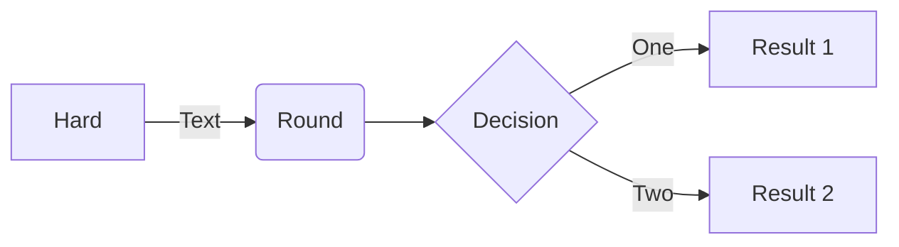
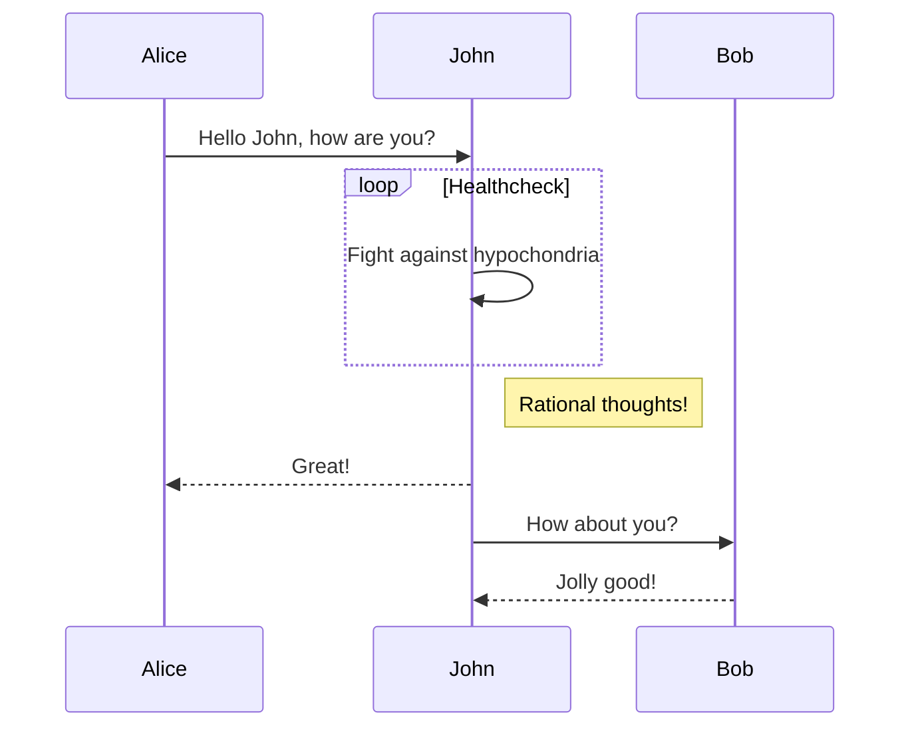
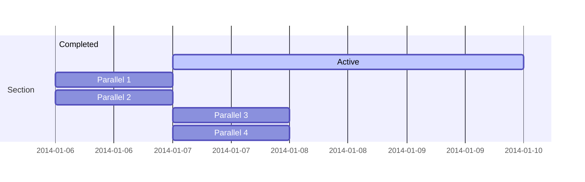
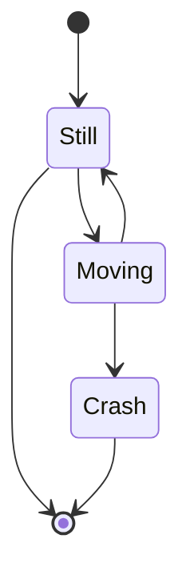
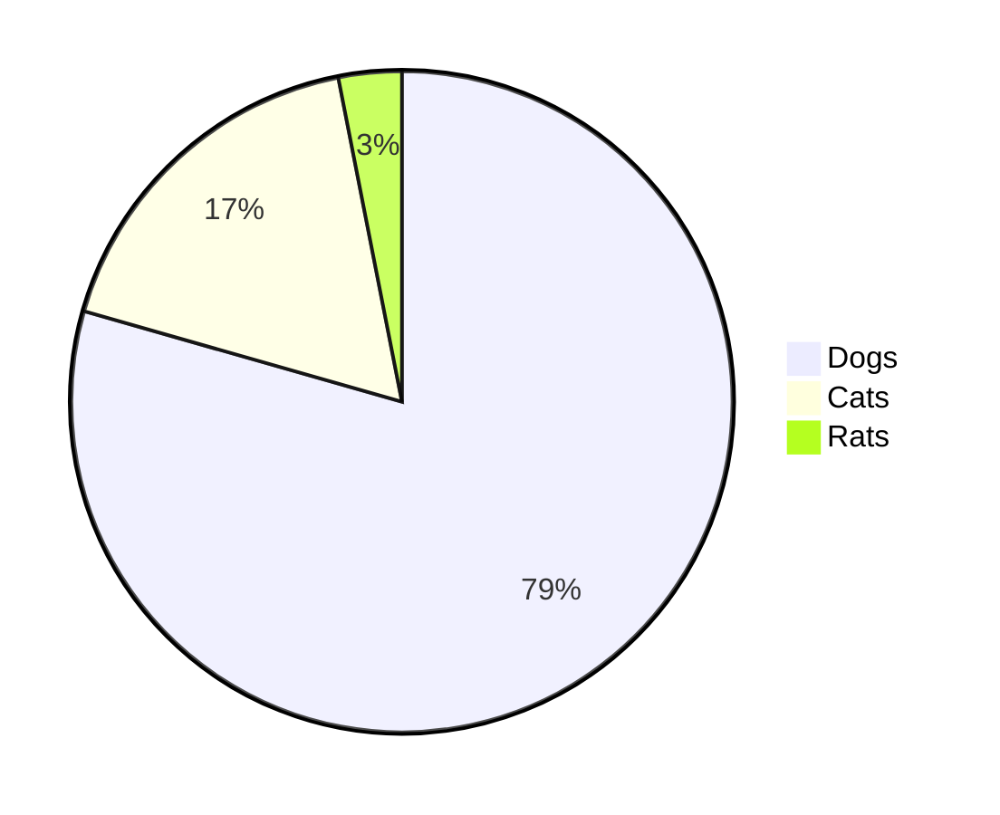
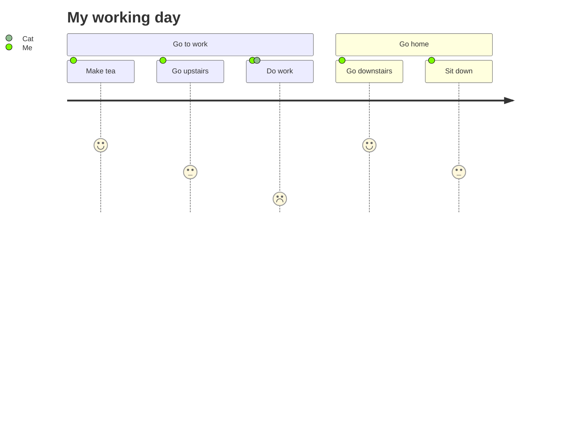

# Yank-Note 特色功能使用说明

[English](./FEATURES.md) | 中文

[toc]{type: "ol", level: [2]}

## 应用数据

应用相关的数据目录存放在 `<home>/yank-note` 下面，点击托盘菜单“打开主目录”即可查看

目录说明：

1. 配置文件 `<home>/yank-note/config.json`
1. 导出 docx 参考文档 `<home>/yank-note/pandoc-reference.docx`
1. 文档历史版本 `<home>/yank-note/histories`
    ::: tip
    如果您不小心丢失了您的文档数据，您可以到此文件夹尝试找回。
    :::
1. 插件 `<home>/yank-note/plugins`
1. 主题 `<home>/yank-note/themes`

## TOC 生成

需要生成目录的地方写入 `[toc]{type: "ul", level: [1,2,3]}`
可以控制目录样式 `ul` 或 `ol` 和级别

## 待办切换

在预览界面打勾试试
+ [x] ~~2021-06-06 10:27~~ TEST1
+ [x] ~~2021-06-06 10:27~~ TEST2
+ [x] ~~2021-06-06 10:27~~ TEST3

## 加密文档

1. 以 `.c.md` 结尾的文档视为加密文档，可以用来保存机密的信息。
2. 加密和解密过程均在前端完成。
3. 请务必保管好文档密码，密码一旦丢失就只能自己暴力破解了。

## Markdown 增强

在编辑器中键入 `/` 可以获得提示

+ 高亮：==marked==
+ 上标：29^th^
+ 下标：H~2~0
+ 脚注：脚注[^1]语法[^2]
+ 缩写：
    *[HTML]: Hyper Text Markup Language
    *[W3C]:  World Wide Web Consortium
    The HTML specification is maintained by the W3C.

### 元素属性书写

此功能使用 [markdown-it-attrs](https://github.com/arve0/markdown-it-attrs) 实现

- 红色文字，白色背景{.bgw style="color:red"}
- 显示为**块元素**{.block}

**一些内置样式类：**

| 类名 | 说明 |
| -- | -- |
| `new-page` | 打印/导出PDF时在此元素前分页 |
| `skip-print` | 打印/导出PDF时跳过此元素 |
| `skip-export` | 导出/复制HTML时跳过此元素 |
| `inline` | 当前元素显示为行内元素 |
| `block` | 当前元素显示为块元素 |
| `reduce-brightness` | 使用暗色主题时候降低此元素亮度 |
| `bgw` | 设置当前元素背景为白色 |

### 图片增强

1. 图片默认会渲染成块元素并居中，背景色透明
    + 如果要显示为行内元素，可以在图片链接参数后面追加 `.inline` 如：
    + 如果要给图片添加白色背景优化展示效果（针对某些透明图片）,可以在图片链接参数后面追加 `.bgw` 如：

1. 可以使用[markdown-it-imsize](https://github.com/tatsy/markdown-it-imsize)的方式来设置图片尺寸
    例如这是一个宽度为 16px 的图片: 

## 思维导图

只需要在列表根节点加上 `{.mindmap}` 即可。

+ 中心节点{.mindmap}
    + [1] 状态可见原则
    + [2] 环境贴切原则
    + [3] 用户可控原则
    + [4] 一致性原则
    + [5] 防错原则
    + [6] 易取原则
    + [7] 灵活高效原则
    + [8] 优美且简约原则
    + [9] 容错原则
    + [10] 人性化帮助原则

脑图使用 [kityminder-core](https://github.com/fex-team/kityminder-core) 实现。

## Mermaid 图形













## Plantuml 图形

如果在配置中选择使用本地端点，则系统需要有 Java 环境，并安装有 Graphviz

::: warning
如果提示 `Cannot find Graphviz`，请参考 [Test your GraphViz installation](https://plantuml.com/graphviz-dot)
:::

示例如下

@startuml
a -> b
@enduml

## 表格增强

此功能使用 [markdown-it-multimd-table](https://github.com/RedBug312/markdown-it-multimd-table) 实现
支持在表格中使用多行文本和列表。支持表格说明渲染

您可以双击/右键单元格快捷编辑单元格内容

First header | Second header
-------------|---------------
List:        | More  \
- [ ] over   | data  \
- several    |
Test | Test
[测试表格]

First header | Second header
:-----------:|:--------------:
AAAAAAAAAAAA | BBBBBBBBBBBBBB
AAAAAAAAAAAA | BBBBBBBBBBBBBB
AAAAAAAAAAAA | BBBBBBBBBBBBBB
AAAAAAAAAAAA | BBBBBBBBBBBBBB
AAAAAAAAAAAA | BBBBBBBBBBBBBB
Test | Test
[小尺寸表格]
{.small}

## Katex 公式

此功能由 [markdown-it-katex](https://github.com/waylonflinn/markdown-it-katex) 插件提供

$$\begin{array}{c}
\nabla \times \vec{\mathbf{B}} -\, \frac1c\, \frac{\partial\vec{\mathbf{E}}}{\partial t} &
= \frac{4\pi}{c}\vec{\mathbf{j}}    \nabla \cdot \vec{\mathbf{E}} & = 4 \pi \rho \\
\nabla \times \vec{\mathbf{E}}\, +\, \frac1c\, \frac{\partial\vec{\mathbf{B}}}{\partial t} & = \vec{\mathbf{0}} \\
\nabla \cdot \vec{\mathbf{B}} & = 0
\end{array}$$

equation | description
----------|------------
$\nabla \cdot \vec{\mathbf{B}}  = 0$ | divergence of $\vec{\mathbf{B}}$ is zero
$\nabla \times \vec{\mathbf{E}}\, +\, \frac1c\, \frac{\partial\vec{\mathbf{B}}}{\partial t}  = \vec{\mathbf{0}}$ |  curl of $\vec{\mathbf{E}}$ is proportional to the rate of change of $\vec{\mathbf{B}}$
$\nabla \times \vec{\mathbf{B}} -\, \frac1c\, \frac{\partial\vec{\mathbf{E}}}{\partial t} = \frac{4\pi}{c}\vec{\mathbf{j}}    \nabla \cdot \vec{\mathbf{E}} = 4 \pi \rho$ | _what?_

## 运行代码

支持运行 `JavaScript` `PHP` `nodejs` `Python` `bash` `bat` 代码。
此功能执行外部命令实现，所以需要安装相应环境。

代码块第一行需要包含以 `--run--` 字符串，示例如下
```js
// --run--
await new Promise(r => setTimeout(r, 500))
ctx.ui.useToast().show("info", "HELLOWORLD!")
console.log('HELLOWORD')
```

```node
// --run--
console.log('HELLOWORD')
```

```php
// --run--
echo 'HELLOWORD!';
```

```python
# --run--
print('HELLOWORD')
```

```shell
# --run--
date
```

```bat
REM --run--
@echo HELLOWORD
```

## 集成终端

1. 使用 `Alt/Option + T` 或者点击状态栏 **切换终端** 菜单唤起集成终端
1. 支持在编辑器中选中一段代码后按下 `Shift + Alt/Option + R` 直接在终端中运行命令。免去复制粘贴。
1. 切换内置终端工作目录到当前目录 `右键目录`

## 小工具

支持在文档中嵌入 HTML 小工具。
HTML 代码块第一行需要包含以 `--applet--` 字符串，其余字符串作为小工具标题，示例如下

```html
<!-- --applet-- Hash -->

<script>
function run (type) {
    const input = document.getElementById('input')
    const output = document.getElementById('output')
    output.value = ''

    switch (type) {
        case 'md5':
            output.value = ctx.lib.cryptojs.MD5(input.value).toString().toLowerCase()
            break
        case 'sha1':
            output.value = ctx.lib.cryptojs.SHA1(input.value).toString().toLowerCase()
            break
        case 'sha256':
            output.value = ctx.lib.cryptojs.SHA256(input.value).toString().toLowerCase()
            break
    }
    output.focus()
    output.select()
}
</script>

<div>
    输入
    <textarea id="input" style="display: block; width: 100%"></textarea>
    <button onclick="run('md5')">MD5</button>
    <button onclick="run('sha1')">SHA1</button>
    <button onclick="run('sha256')">SHA256</button>
    <textarea id="output" style="display: block; width: 100%"></textarea>
    <button onclick="document.getElementById('input').value = ''; document.getElementById('output').value = ''">清空</button>
    <button onclick="var x = document.getElementById('output'); x.value = x.value.toUpperCase()">结果大写</button>
</div>
```

如果没有标题，将没有外部边框装饰

```html
<!-- --applet--  -->
<button onclick="ctx.ui.useToast().show(`info`, `HELLOWORLD!`)">HELLO</button>
```

## ECharts 图形

Js 代码块第一行包含以 `--echarts--` 字符串会被解析成 ECharts 图形，示例如下

```js
// --echarts--
function (chart) {
chart.setOption({
    // backgroundColor: '#2c343c',

    title: {
        text: 'Customized Pie',
        left: 'center',
        top: 20,
        textStyle: {
            color: '#888'
        }
    },

    tooltip : {
        trigger: 'item',
        formatter: "{a} <br/>{b} : {c} ({d}%)"
    },

    visualMap: {
        show: false,
        min: 80,
        max: 600,
        inRange: {
            colorLightness: [0, 1]
        }
    },
    series : [
        {
            name:'访问来源',
            type:'pie',
            radius : '55%',
            center: ['50%', '50%'],
            data:[
                {value:335, name:'直接访问'},
                {value:310, name:'邮件营销'},
                {value:274, name:'联盟广告'},
                {value:235, name:'视频广告'},
                {value:400, name:'搜索引擎'}
            ].sort(function (a, b) { return a.value - b.value; }),
            roseType: 'radius',
            label: {
                normal: {
                    textStyle: {
                        color: '#888'
                    }
                }
            },
            labelLine: {
                normal: {
                    lineStyle: {
                        color: '#888'
                    },
                    smooth: 0.2,
                    length: 10,
                    length2: 20
                }
            },
            itemStyle: {
                normal: {
                    color: '#c23531',
                    shadowBlur: 200,
                    shadowColor: 'rgba(0, 0, 0, 0.5)'
                }
            },

            animationType: 'scale',
            animationEasing: 'elasticOut',
            animationDelay: function (idx) {
                return Math.random() * 200;
            }
        }
    ]
}, true)
}
```

## Draw.io 图形

链接属性 `link-type` 值需要是 `drawio` 字符串。使用链接的形式也不会影响其他 Markdown 解析器解析。

```markdown
[drawio](./test.drawio){link-type="drawio"}
```

## Luckysheet 表格

链接属性 `link-type` 值需要是 `luckysheet` 字符串。使用链接的形式也不会影响其他 Markdown 解析器解析。

```markdown
[luckysheet](./test.luckysheet){link-type="luckysheet"}
```

## 容器块

支持类似 [VuePress 容器块](https://v2.vuepress.vuejs.org/zh/reference/default-theme/markdown.html#%E8%87%AA%E5%AE%9A%E4%B9%89%E5%AE%B9%E5%99%A8) 功能，使用 [markdown-it-container](https://github.com/markdown-it/markdown-it-container) 实现

**使用**

```md
::: <type> [title]
[content]
:::
```

`type` 是必需的， `title` 和 `content` 是可选的。

支持的 `type` 有：`tip` `warning` `danger` `details` `group` `group-item`

**示例**

::: tip
这是一个提示
:::

::: warning
这是一个警告
:::

::: danger
这是一个危险警告
:::

::: danger STOP
危险区域，禁止通行
:::

::: details
这是一个 details 标签
:::

::: details 点击展开更多
这是一个 details 标签
:::

:::: group 这是标签组

::: group-item Tab 1
test 1
:::

::: group-item *Tab 2
test 2
标题前带 `*` 表示默认激活此选项卡
:::

::: group-item Tab 3
test 3
:::

::::

## Front Matter

页面支持类似 [Jekyll Front Matter](https://jekyllrb.com/docs/front-matter/) 配置信息

内置变量

变量名 | 类型 | 描述
---- | ----- | ---
`headingNumber` | `boolean` | 是否开启页面标题序号编号
`enableMacro` | `boolean` | 是否开启宏替换
`define` | `Record<string, string>` | 宏定义，定义文本替换
`mdOptions` | `Record<string, boolean>` | Markdown-it 解析参数
`mdOptions.html` | `boolean` | 开启 HTML 解析
`mdOptions.breaks` | `boolean` | 转换 `\n` 成 `<br>`
`mdOptions.linkify` | `boolean` | 自动转换链接
`mdOptions.typographer` | `boolean` | 开启语言替换和引号美化

## 宏替换

> <a href="javascript: ctx.showPremium()">高级版可用</a>

Yank Note 允许你在页面中嵌入宏，用以动态地替换文档。

使用前需要先在 Front Matter 开启宏替换，定义 `enableMacro: true`

### 文本替换

Front Matter 中的 `define` 字段可以定义一些文本替换映射。支持在另一个文件定义，支持宏表达式。具体可参考本文件顶部 Front Matter 部分。

- 应用名: --APP_NAME--
- 应用版本: --APP_VERSION--
- 另一个文件的定义: --TEST_DEFINE--

### 宏表达式

语法：

```md
[= <expression> =]
```

其中 `expression` 是需要执行的 js 表达式，支持 await/Promise 异步表达式。

如果表达式中需要包含 [\= 或 =\] 请输入 `[\=` 或 `=\]` 转义替换

### 一些示例

- 是否开启页面标题序号编号: [= headingNumber =]
- 使用变量: [= customVar =]
- 定义变量: [= $export('testVar', 'Test') =][= testVar =]
- 定义函数:  [= $export('format', (a, b) => `${a}, ${b}!`) =][= format('HELLO', 'WORLD') =]
- 应用版本：[= $ctx.version =]
- 当前文档名: [= $doc.basename =]
- 当前时间: [= $ctx.lib.dayjs().format('YYYY-MM-DD HH:mm') =]
- 限定符转义: [= '[\= =\]' =]
- 四则运算: [= (1 + 2) / 2 =]
- 引用文件（支持最多嵌套 3 层，可使用目标文档中定义的 Front Matter 变量)
    > [= $include('./_FRAGMENT.md', true) =]
- 被引用文档中定义的变量：[= customVarFromOtherDoc =]
- 你的 IP 地址：[= fetch('https://ifconfig.me/ip').then(r => r.text()) =]
- 天气预报
    ```
    [= await ctx.utils.sleep(1000), fetch('https://wttr.in?0AT').then(r => r.text()) =]
    ```
- 九九乘法表
  [=
  (function nine (num) {
      let res = ''
      for (let i = 1; i <= num; i++) {
          let str = '';
          for (let k = 1; k <= num; k++) {
              if (i >= k) {
                  str += k + 'x' + i + '=' + i*k + ' ';
              }
          }
          res = res + str + '\n'
      }
      return res
  })(9)
  =]

### 可用变量

宏表达式可以使用在 Front Matter 定义的变量，也可以使用下面的内置变量

变量名 | 类型 | 描述
---- | ----- | ---
`$ctx` | `object` | 编辑器 `ctx`，可参考[插件开发指南](PLUGIN.md) 和[Api 文档](https://yn-api-doc.vercel.app/modules/renderer_context.html)
`$include` | `(path: string, trim = false) => Result` | 引入其他文档片段方法
`$export` | `(key: string, val: any) => Result` | 定义一个本文档可以使用的变量
`$noop` | `() => Result` | 无操作函数，可用于文本占位使用
`$doc` | `object` | 当前文档信息
`$doc.basename` | `string` | 当前文档文件名（无后缀）
`$doc.name` | `string` | 当前文档文件名
`$doc.path` | `string` | 当前文档路径
`$doc.repo` | `string` | 当前文档仓库
`$doc.content` | `string` | 当前文档内容
`$doc.status` | `'loaded', 'save-failed', 'saved'` | 当前文档状态

## 命令行参数

在向别人交接文档的时候，可以使用脚本，自定义命令行参数启动程序，方便对方查看文档。

名称               | 作用         | 默认值 | 说明                    | 示例
----------------- | ------------ | ----- | ----------------------- | ----
--port            | 服务器监听端口 | 3044 | 端口                      | --port=8080
--disable-tray    | 禁用常驻托盘   | false | true/false              | --disable-tray
--readonly        | 编辑器只读    | false | true/false               | --readonly
--show-status-bar | 显示状态栏    | true  | true/false               | --show-status-bar=false
--data-dir        | 数据目录      | 无     | 目录路径字符串            | --data-dir='./.data'
--init-repo       | 初始仓库名    | 无    | 字符串                    | --init-repo='test'
--init-file       | 加载文件路径  | 无    | 文件路径，相对于仓库路径     | --init-file='/1.md'

## 自定义样式

1. 右键点击托盘图标，点击“打开主目录”，进入 `<主目录>/themes` 目录。
2. 复制 `github.css` 为一个新 CSS 文件，修改 CSS 内容
3. 打开设置 => 外观 => 自定义 CSS 切换 CSS 配置

## 插件开发

请参考[插件开发指南](PLUGIN_ZH-CN.md)

[^1]: 这是一个脚注
[^2]: 这也是一个脚注
