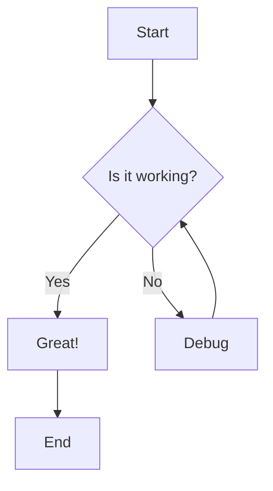
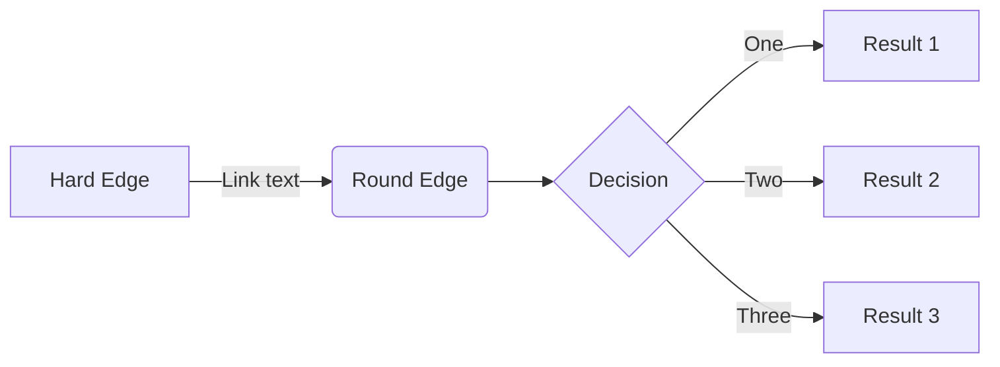
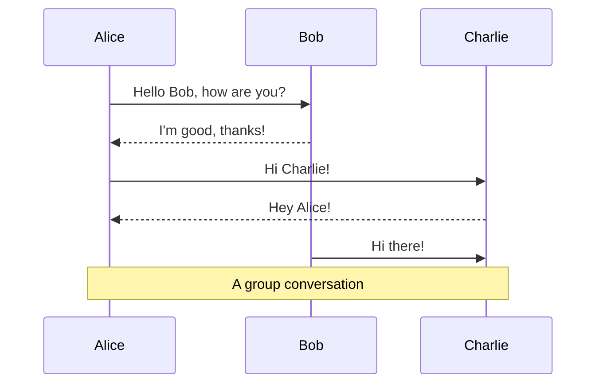
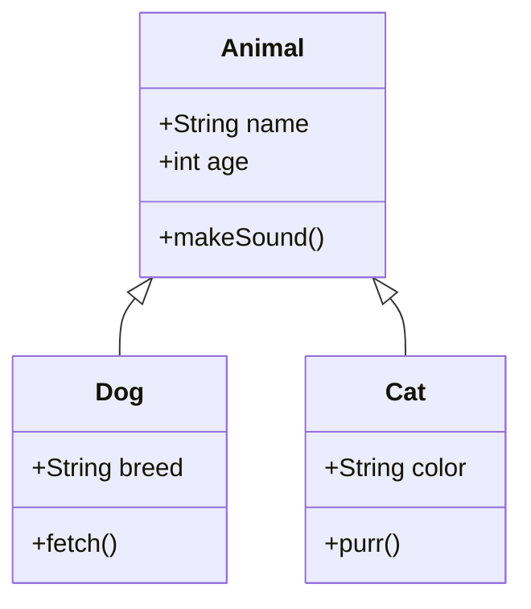
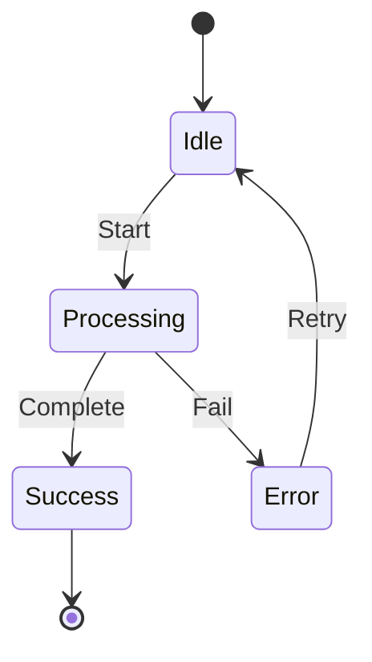
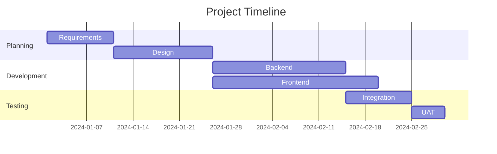
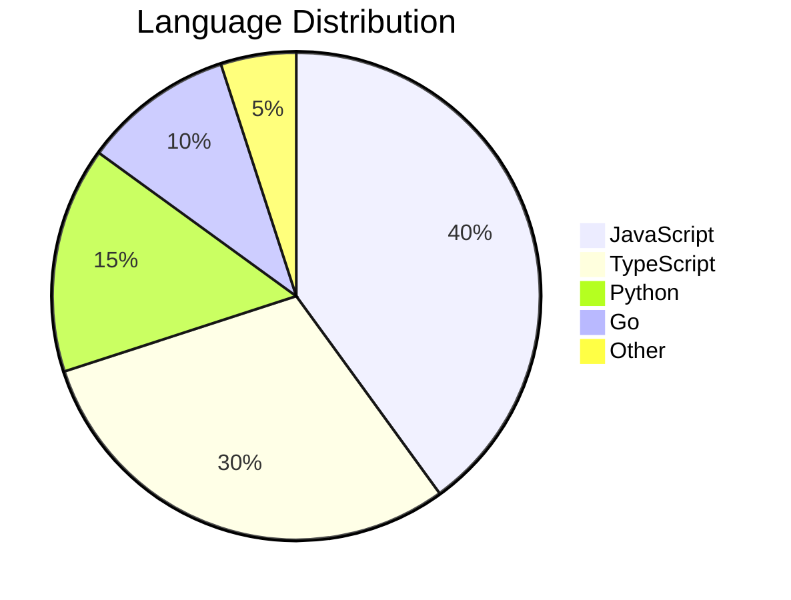
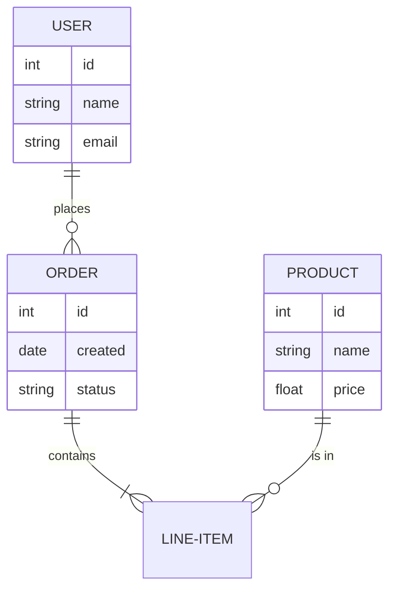
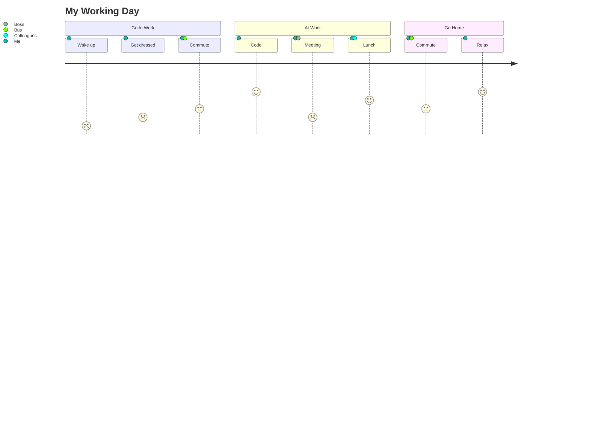

# Mermaid Diagrams Test

This document tests Mermaid diagram rendering in Yank Note.

> **Note**: Requires the `@yank-note/extension-mermaid` extension.

## Flowchart

## Flowchart (Left to Right)

## Sequence Diagram

## Class Diagram

## State Diagram

## Gantt Chart

## Pie Chart

## Entity Relationship Diagram

## Journey Map

